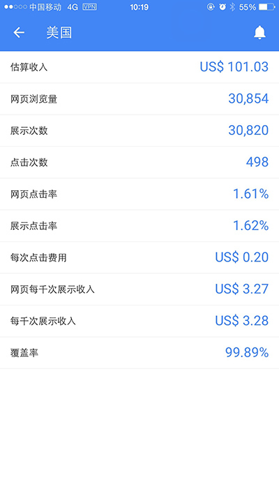
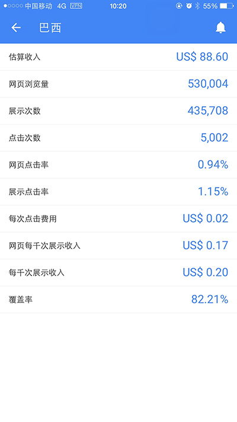
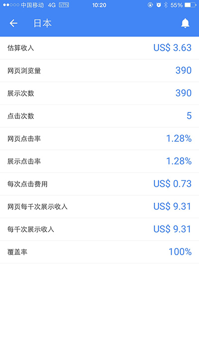
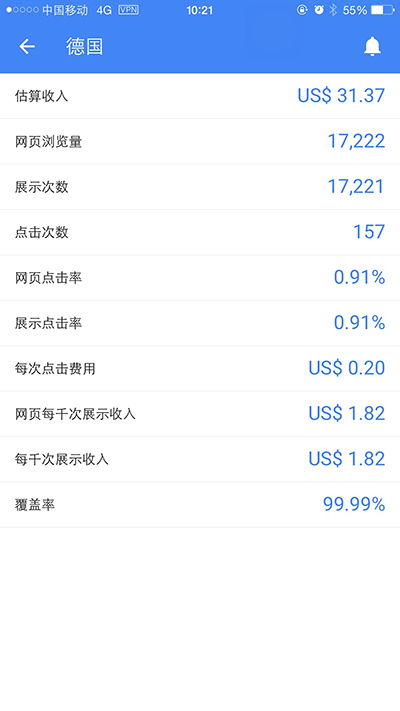

## From Coding to Monetization：Programmer's Financial Freedom Approach

【从编码到变现：程序员财务自由之路】

[中文版本/Chinese Version](./README.md)


## Content

* [Foreword](#Foreword)
* [Positioning](#Positioning)
* [Getting Started](#Getting-Started)
  * [Language and Tools](#Language-and-Tools)
  * [Hello, World!](#hello-world)
  * [Simple APP](#simple-APP)
  * [Add Ad Banner](#add-ad-banner)
  * [Register Ad Account](#register-ad-account)
  * [Settings for Payment](#settings-for-payment)
  * [Publish APP](#publish-app)
  * [Calcuate Ad Revenue](#calculate-ad-revenue)
* [Advanced](#advanced)
  * [Demand is Fundamental](#demand-is-foundamental)
  * [User Experience](#user-experience)
  * [What Ad is Best](#what-ad-is-best)
  * [Which Ad Network Shall I Choose](#which-ad-netowrk-shall-i-choose)
  * [Promote Your APP](#promote-your-app)
  * [Online APP](#online-app)
  * [Cloud Service](#cloud-service)
* [Expert](#exert)
  * [Data Analysis](#data-analysis)
  * [Ad Optimization](#ad-optimization)
  * [In-App Purchase](#in-app-purchase)
  * [Social Marketing](#social-marketing)
  * [Advertising](#advertising)
* [Appendix](#appendix)
  * [Internet Marketing Terminology](#internet-marketing-terminology)
  * [How to Publish APP to Apple AppStore](#how-to-publish-app-to-app-store)
  * [How to Publish APP to Google Play Store](#how-to-publish-app-to-google-play-store)
  * [How to Google Analytics for Data Analysis](#how-to-use-google-analytics-for-data-analysis)

### Forword

This book, is written for programmer.

It's not about a programming language, not about a design pattern, and not about how to estimate man-hour, or how to manage project.

This book is about: monetization. Simply speaking, how to earn money.

As a programmer, you must have spent much time to learn, mastered several programming lanugages, used dozens of developing tools. In order to design stable and flexible architecture, you may have learned various design patterns. In order to boost working efficiency, you may have used many mature frameworks and automation testing tools. In short, you become an excellent programmer.

And, you may even accumulate experience in management, take the initiative to learn the theoretical knowledge of project management, mastered a variety of R&D organizating model, become the R&D team leader or manager.

In most cases, as a programmer or R&D team, you work on requirements analysis, architecture design, module demarcation, interface design, coding implementation, testing, and release versions, as required by the project manager or product manager. These tasks, no doubt, are the most familiar routine work for programmers.

Unfortunately, for most programmers, your everyday concerns are just development. Accept requirements, deliver versions, that's all the product manager or the client has you to do. Even many excellent programmers or technical guru, they seldom care how software brings revenue directly. Most developers, just focus on R&D technical work, or even just focus on coding work, which is very limited.

In fact, R&D, plus sales, payment, promotion, customer support, and maintenance, is the complete closed-loop of software's value chain.

This book is about how to start from coding, to get paid, and how to get users. Step by step, on every details.

Once you have mastered how to monetize from your software, youo will be more concerned with user feedback, caring about market needs, and the quality of your products. As they will bring you better financial returns. Then it's not far away to achieve financial freedom.

If you feel that the content of this book is helpful, please give you support, by staring it.

### Positioning

Since it is to talk about earning money, we will not discuss the hard way of outsourcing, in which the business model is to sell limited life time as money.

Considering factor of limited man power, time and resource, we will not discuss carrier-class, or enterprise-class large-scale systems. As they require large investment and long research cycle for complex requirement, which is beyond congrol of individuals and small teams.

We focus on individuals or small teams. In the era of mobile internet, we have heard many miracle stories about individuals or small teams earn lots of money or even grow fast to unicorn enterprise.

Real story 1:
[Flappy Bird](https://zh.wikipedia.org/wiki/Flappy_Bird) legend, a small mobile game developed by a Vietnam programmer in 2-3 days, swept the globe in just a few weeks, and bring income of $50,000 US dollors each day. This is undoutedly by chance, lucky guy, but at least, there is a probability of occurrence.

Real story 2:
I know a Polish programmer, who uses the web page technology to make an uncomplicated calculator APP, doing something like calculating tip or percentage. The APP stays in the financial apps top list of App store in several Eroupe countries, made a lot of money.

Real story 3:
I have been working in a company that develops insurance software some years ago. The company had developed fairly well, and the management tried to IPO. However, they have not been able to take off and IPO yet, because the business model was too close to the outsourcing model, rather than the product model or platform model. Two of my former colleagues left this company and set up a start-up, developing a short video APP on a mobile phone, and successfully becoming a short video community platform. A few days ago, after three years of hard work, they were acquired for $1 billion US dollars. Yes, their name is Musical.ly, you can find it in the top list of app stores.

You can find other similar success stories, about making good money from mobile apps or games. You may heard, or just google the internet.

In this book, what we want to explore, is to make full use of limited time and resource, focus on a very narrow area of requirement, to develop a very unique mobile app or small game, publish to global app store, acquire users, and make money.

Perhaps, you are a technical guru, who masetered dozens of programming languages, design patterns, front-end to back-end full stack development capabilies. However, not every technology can be used to make quick money. The hardest or most intersting technology, may not be the easiest technology to make money. Sometimes, we need most flexible and scalabe architecture. Sometimes, we have to choose the most rapid development methods.

Maybe, you are a newbie, just getting started, and only know how to write a webpage. It does not matter. The programming skills required to make money, can also be very simple. Just one thing, if any knowledge is required, we have to learn it quickly. We are in a era of fast changing world, programmers must be good at learning new things.

## Getting Started

### Language and Tools

The language and tools for developing apps are often tied to the platform.
* If it is iOS, it is usually Objective C, and the development tools are [Xcode](https://developer.apple.com/xcode/) from Apple (development tools only run on Mac) toolset.
* If it's Android, it's usually Java, and development tools are Google's [Android Studio](http://developer.android.com/tools/studio/index.html) (a cross-platform development tool) toolset.
* If it is Windows Phone, that is C #, the development tool is Microsoft's [Visual Studio](https://www.visualstudio.com/en-us/visual-studio-homepage-vs.aspx) toolset (only run On Windows)。

In addition, there are some cross-platform languages and tools, more friendly to developers. Develope once, package and release on multiple platforms:
* HTML5, can be used to develop apps and games, javascript is the core language.
* [Cocos2d-X](http://www.cocos2d-x.org/) for game development, C++ is the core language.
* [Unity3D](http://unity3d.com/) IDE and integrated MonoDevelop, C# is the core language.
* [Xamarin](https://www.xamarin.com/) acquired by Microsoft, and its sponsored open source project [Mono](http://www.mono-project.com/), used to develop APP, C# is the core language.

In the tutorial below, we chose the easiest javascript as the main development language for subsequent content. In fact, it is also the most active language on github. It can be used to develop:
* Web pages, running in browser;
* Single-page WebApp, running in browser;
* Command line tools, based on [nodejs](https://nodejs.org/);
* Network cloud services, based on nodejs;
* Hybrid APP, based on [cordova](http://cordova.apache.org/) technology;
* APP with native UI experience, based on [react-native](http://www.reactnative.com/).
* Even desktop applications, such as the Adobe Brackets code editor, also developed with javascript.

JavaScript can be used to develop front-end and back-end, code logic can be reused, thereby reducing the skill threshold and development costs. The requirements of the development environment is also very low, as long as there is a friendly code editor, a browser for testing and debugging, that's almost enough.

The following are the the necessary environment and tools for development with javascript:
* Chrome browser, comes with developer tools and javascript console for running and debugging.
* [Adobe Brackets](http://brackets.io/) text editor (if you're used to [Sublime Text](http://www.sublimetext.com/) or [Atom](https://atom.io /) Or [Visual Studio Code](http://code.visualstudio.com/), no problem)
* iMac, with a huge 27-inch screen, really wide view for many windows, MacBook or Air is also okay;
* Mac OS X command line is very powerful, and convenient to support most LInux tools through [MacPorts](https://www.macports.org/) or [Homebrew](http: // brew.sh/).
* Xcode (Mac version only), must-have to build and debug iOS apps.
* Android Studio, used to build and debug Android APP.

If you get used to Windows and do not have a Mac, it's also okay, you can develop for Android at hand. As to iOS, you may need some online service for apps building and packaging, like Adobe PhoneGap Build, or Intel XDK, etc. You can google how to use them. 

But, a Mac is still recommended, for both Android and iOS development.

### Hello, World!

To development frond-end app with javascript, in fact, there are three closely related languages: HTML / javascript / CSS.
* HTML is responsible for the content.
* javascript is responsible for logic.
* CSS is responsible for rendering.

Here is a simple example:
```html
<!-- index.html -->
<!DOCTYPE html>
<html>
<head>
<meta charset="utf-8" />
<title>Hello</title>
<script type="text/javascript" src="main.js"></script>
<link rel="stylesheet" href="main.css"/>
</head>
<body>
<h1>Hello, World!</h1>
</body>
</html>
```
```javascript
// main.js
console.log('hello, world!');
```
```css
/* main.css */
body {
  width: 100%;
  height: 100%;
  padding: 0px;
  margin: 0px;
}
h1 {
  color: blue;
  padding: 40px;
  margin: 10px;
  border: 1px solid gray;
  display: inline-block;
}
```

Open it with Chrome and we see the following display:
* The main browser window above shows the contents of the HTML and is rendered in the format and effect specified by the CSS.
* Open the Chrome console window, it shows the javascript call console.log () output debugging information.


Using HTML5 / javascript to do development, getting started is as simple as that.

If you need to develop high-quality apps, you need to master HTML / CSS and javascript, especially HTML5 / CSS3, master HTML DOM and some javascript libraries, such as [jQuery](https://jquery.com/), etc. Here are some free tutorials for getting started:
* [HTML series tutorial](http://www.w3school.com.cn/h.asp)
* [JavaScript Tutorial](http://www.w3school.com.cn/js/index.asp)
* [JavaScript Advanced Tutorial](http://www.w3school.com.cn/js/index_pro.asp)

Through these tutorials, you can learn:
* A simple index.html page;
* A unified main.css file that controls and adjusts the presentation of interface elements
* A set of javascript files that enable dynamic presentation and switching of content through access to the HTML DOM.

For you, as a programmer, this is not hard at all.

### Simple APP

Next, we want to turn such a simple web app into a mobile app. To be exact, it should be called Hybrid APP, a hybrid program. Because it's native app, it wraps a webview, which runs the web app we wrote.

We need to use a technical framework called Cordova.

Originally a product developed by a small team acquired by Adobe, it was renamed [PhoneGap](http://phonegap.com/). Adobe later turned it open source and donated it to the Apache Foundation, then called [Apache Cordova](https://cordova.apache.org/).

Now Cordova has become a very popular technical framework, but also sought after by many commercial companies, in addition to Adobe, Intel, Microsoft, IBM and other companies have also introduced support Cordova products.

The Cordova technology framework provides a command-line tool developed using nodejs, as well as a variety of plug-ins.

We first have to install [nodejs](https://nodejs.org/en/), after installation, it will provide two basic commands:
```bash
$ which node
/usr/local/bin/node
$ node -v
v4.8.4
$ npm -v
2.15.11
```

* node --- the javascript engine, compile / interpret / execute. It is based on Google's open source Chrome V8 engine,  event-driven, non-blocking IO mode operation, lightweight and efficient.
* npm --- NodeJs Package Manager, install package manager. All nodejs packages are downloaded and installed using npm (you can also use it to publish your own packages to the npm repository)

Next, use npm to install [cordova](https://cordova.apache.org/)：
```bash
$ npm install -g cordova
$ which cordova
/usr/local/bin/cordova
$ cordova -v
7.1.0
```

Create a project with Cordova CLI:
```bash
# Syntax：cordova create <folder> <APP ID> <APP name>
$ cordova create temp com.rjfun.demo Demo
```

Compile and build, then run the app in iOS emulator:
```bash
$ cd temp
$ cordova platform add ios
$ cordova build ios
$ cordova emulate ios
```

Now we will see the iOS emulator is started, and APP launched:


Or, you can also connect your iPhone device to Mac, the use following command to install and launch the APP:
```bash
$ cordova run ios --device
```

Now the running one is Cordova's Demo project. Open Cordova project, you can see this directory structure:


Next, delete the contents of the www directory, replace with the index.html, main.js, main.css we wrote earlier and make a few changes:
```html
<!-- index.html -->
<!DOCTYPE html>
<html>
<head>
  <meta charset="utf-8" />

  <!-- The section below is to fit mobile devices -->
  <meta http-equiv="Content-Security-Policy" content="default-src 'self' data: gap: https://ssl.gstatic.com 'unsafe-eval'; style-src 'self' 'unsafe-inline'; media-src *">
  <meta name="format-detection" content="telephone=no">
  <meta name="msapplication-tap-highlight" content="no">
  <meta name="viewport" content="user-scalable=no, initial-scale=1, maximum-scale=1, minimum-scale=1, width=device-width">

  <!-- auto generated by cordova, to initialize the cordova framework -->
  <script type="text/javascript" src="cordova.js"></script>

  <title>Hello</title>
  <script type="text/javascript" src="main.js"></script>
  <link rel="stylesheet" href="main.css"/>
</head>
<body>
<h1>Hello, World!</h1>
</body>
</html>
```

```javascript
// main.js
console.log('hello, world!');

// When the app is initialized, the 'deviceready' event is fired and we can call the cordova framework and the APIs and functionality provided by the plug-in
document.addEventListener('deviceready', function(){
  console.log('deviceready');
  
  // TODO: Start the business logic of our web app
});
```

```css
/* main.css */
body {
  width: 100%;
  height: 100%;
  padding: 0px;
  margin: 0px;
  background-color: silver;
}
h1 {
  padding: 40px;
  margin: 30px;
  background-color: yellow;
  color: blue;
  border: 1px solid gray;
  display: inline-block;
}
```

Rerun the cordova project (it will compile, install, run automatically):
```bash
$ cordova emulate ios
```

So, you can see that Web App is running in the iOS simulator:


To write an easiest APP, in fact, is really  simple, isn't it?

### Add Ad Banner

As a programmer, we have no doubt that you have mastered the HTML / CSS and javascript programming capabilities to provide some interesting and useful features.

Next, we want to add monetization to the app, which is to make real money.

The easiest way to realize is to add an ad banner, such as Google's AdMob.
* By showing ads, users click on interesting ads, browse the product, or install other apps.
* Advertisers / advertisers (advertisers, Advertizer) pay advertising costs to Google.
* Google will pay a portion of it to the person / company (publisher, publisher) who posted the ad.
* Google's role in it is called the Ad Platform, or Ad Network.

The technical architecture of the Cordova framework is a web app with some common plug-ins that provide access to specific functions of the handset and integration with third-party systems.

We implemented integration with Google AdMob via the plug-in cordova-plugin-admobpro. This is a plug-in based on the Google AdMob SDK, and is the most popular and easiest to use plug-in for the moment. Through it, just a line of javascript code to complete the SDK API call.

Now let's add plugins to the cordova project.

```bash
$ cordova plugin add cordova-plugin-admobpro
```

Modify main.js, let's add a few lines into the initialization:

```javascript
// main.js
console.log('hello, world!');

// When the app is initialized, the 'deviceready' event is fired and we can call the cordova framework and the APIs and functionality provided by the plug-in
document.addEventListener('deviceready', function(){
  console.log('deviceready');
  
  // When the app is initialized, create an ad banner below the screen
  if(AdMob) AdMob.createBanner({
    adId: 'ca-app-pub-6869992474017983/4806197152', // need to register as a user on the AdMob website and create an Ad Unit Id
    position: AdMob.AD_POSITION.BOTTOM_CENTER, // show at bottom / center
    overlap: false, // no overlap the web app content
    isTesting: true, // show testing ad, please remove this line when formal release
    autoShow: true // auto show it when ad resource downloaded and ready
  });
});
```

Rerun the cordova project (it will compile, install, run automatically):
```bash
$ cordova emulate ios
```

So, you can see that Web App is running in the iOS simulator:


Look, at the bottom of the screen, the banner is displayed.

This is just a test advertisement for debugging purposes only.

We need to register the user on [AdMob official website] (https://apps.admob.com/) and create an Ad Unit Id that replaces the string of digits following adId in the code. And in the official version of the release, remove the `isTesting: true` line of code.

### Register Ad Account

Here we introduce, how to register account, how to create ad unit, how to set bank receipt information.

Visit Google's AdMob website (https://www.google.com/admob/) to sign up for a new account.


After registering, visit the AdMob website (https://apps.admob.com/), click on the menu "monetization", click on the red button in the upper left corner "+ monetize new application" to add a new APP:


Then create banner ads:


You can get the ad unit ID, copy it to the source code:


### Set Payment Info

After registering your account, you can accumulate ad revenue by putting the ad unit into the APP for user actual usage.

There are two more steps to complete the Google advertising payment you receive:
* Verify address. Google will generate a PIN code printed on the card, send to your mailing address.
* Set up payment information. Can be Western Union or bank account.

However, newly registered account has no access to set bank information. Only your cumulative advertising revenue reached the basic threshold (currently 10 US dollars), Google will allow you to set up payment information. Through this method, Google can filter out a large number of non-active accounts.

#### Verify PIN Code


Click "Fix It", enter PIN input UI.


This process of verifying your PIN is slow and typically takes 2-4 weeks.

So, if the date of the most recent PIN was displayed, wait patiently. After receiving the PIN code, it will be entered in the box above, submitted for verification.

#### Set Payment Info


After the two steps are set up, when the advertising revenue, Google will calculate the advertising revenue of the month at the end of each month, and pay you around the 20th of next month.

### Publish APP

The APP we developed, to be installed by user and generate revenue, needs an important part: released to the app store.
* If Android APP, usually Google Play Store.
* If iOS APP, released to Apple AppStore.

Here we use the Apple AppStore as an example, to illustrate how to register a developer account and publish an app.

Visit the Apple Developers Web site (https://developer.apple.com/) and sign up for login. To release an app on the Apple AppStore, you pay an annual fee of $ 99 a year, which is the same for individual developers and corporate developers.


The following steps are needed to publish APP to the AppStore:
* Generate developer digital certificate for installation package signature.
* Create an APP ID for your APP, or use "*" or "com.rjfun. *" As a generic APP ID for more than one app, if no in-app purchase.
* Generate Provisioning Profiles for your APP, download it locally, open it in Xcode, and manage it.

Then use Xcode to open the XXX.xcodeproj project file in the Cordova project, compile and archive (Archive). Successfully archived APP packages can be submitted to AppStore for review.

You need to log into iTunesConnect (https://itunesconnect.apple.com/), to prepare, publish and manage your APP.


Create a new APP, add the name, introduction, icon, pricing and other information, and set it as ready to submit the status, and then you can Organizer Xcode in the successful archive (Archive) installation package submitted to the AppStore for review .


Usually it will take Apple 2 or 3 days to review your app. If the review passes, you can see your app in the AppStore.

### Calculate Ad Revenue

When a user downloads, installs and runs an app on his device, he or she requests the official ad content from Google's ad server for display.

You can visit the Google AdMob website to see daily ad impressions, clickthrough rates, and revenue. This site also offers very powerful reporting capabilities that show very detailed reports based on country, ad unit, time period. Google has an AdSense app on the AppStore, and you can install this app on your phone to see your AdMob earnings daily.

Each time a user clicks on an ad of interest, it generates advertising revenue. Most of your ad serving is calculated based on the number of clicks, the so-called CPC ads.

In calculating advertising revenue, there are several common basic terms:
* CPC (Cost Per Click, cost-per-click) is about US $ 0.06 ~ 1.0;
* CTR (Click Through Rate, show CTR), the result of a large number of statistics is about 1%;
* CPM (Cost Per Mile, CPM), CPM can also be calculated by CPC and CPR, the approximate range is US $ 0.5 ~ 20.

The price per click varies based on the type of ad, the price that is served, and so on. Since different countries in the world have different economic levels, there are also big differences.

E.g,
* In the United States, an ad click may yield a gain of $0.2;
* In Brazil, maybe only 2 cents, a difference of 10 times.
* In Japan, clicks on advertising revenue is quite high.

The following is a comparison of a set of data:

USA | Brazil
---|---
 | 
Japan | Germany
 | 

If we conservatively estimate $1 CPM (cost per thousand impressions), 100,000 ads per day will generate about $100 in cash. Then it will generate $3,000 in a month (including weekends and holidays!).

Let's compare it with the average programmer's salary. In Shanghai, an experienced programmer with 5 year experience, the salary is about $2,300 or so. If you make such the APP, with 10,000 DAU (daily active user), the revenue generated from advertising can exceed the salaries of a programmer. Or even more, if optimized very well.

I know a Brazilian, develop his game with HTML5 technology, simple, but very interesting. Daily active users is about 100,000, advertising revenue has more than $25,000 per month, so as to achieve the financial freedom.

### Advanced

### Demand is fundamental

Earlier we described how to add monetization to APP. But to really get a decent return, you still have to get enough users. In other words, you have to develop enough good APP, can really solve the user's problem, will have more users, more frequent use.

How to develop a more popular APP? In fact, this is not a programming problem.

Perhaps you are a technical expert, using the most difficult, coolest technology, but the software products developed, may not be welcomed by users of the product. Sometimes, you use a technology that is actually relatively simple, but really pay attention to the user's pain points, to solve the user's concerns, it is possible your product will be welcomed by users, because of good reputation in the social network to get the natural spread.

I recommend a book, "Demand - the Fundamentals of Creating Great Business Legends," by Adrian Silesivski.

Here are some tips from entrepreneurs:

> This is a good book worth every entrepreneur and every manager of the company to read, and even everyone in the organization should understand the concepts. The book gives some models for creating needs, which are very valuable to readers, we need good ideas, but we need more ways to practice ideas. These two books are done, very worth reading, especially recommended.
- Sun Taoran, founder, chairman and president of La Cara Pay Ltd., author of "Entrepreneurship 36 Military Regulations".

> Behind every complaint is hidden an unmet need, and behind every need inevitably hides a market that can not be ignored. In fact, any product that meets the functional needs of the user from the outset should be upgraded to the spirit level, the user refuses to trouble, the user needs comfort, it does not seem to have anything to do with the profit, but I'm sorry, it is related to your market. You do not meet, entrepreneurs will go to their own ground-breaking satisfaction. Then waiting for you, or will be a huge crisis of life and death. Therefore, please pay attention to the hope of trouble, rather than to their complaint. This is exactly the most valuable thing that "demand" brings to us.
- Du Zijian, founder of Huayi Media, social media marketing researcher, bestseller "Boundless" author.

### User Experience

Although the sale of Apple mobile phone is very expensive, but still very popular, why? It is undoubtedly the best user experience to win. If you read "Steve Jobs Biography", you can know that the birth of Apple's mobile phone, in fact, is to solve the pain of traditional phones difficult to use.

Naturally, the app or game we develop on our mobile phone must also be highly user-focused and put it in a strategic position. Mobile APP, not the pursuit of powerful features, complete, you can only do a small feature, but to effectively focus on the needs of users, and provide excellent user experience.

A rather typical example is this "Flashlight" APP, which is to turn on the phone's LED bulb to temporarily light up the darkness.


This APP has more than hundreds of millions of users, of course, its economic return is also extremely impressive.

The number of user comments exceeded 6 million and the users wrote:
* Jennifer Baylis: easy to use. # 1 The best Flashlight APP! Very easy to use, open very fast!
* Kitty Davis: I just need such a flashlight APP.
Dennis Castello: It's exactly what it takes and it's done really well.
* Joseph Low: easy to use. Let it work easily! highly recommended!

### What Ad is Best

In the mobile advertising arena, there are many forms of advertising, and are also constantly evolving.
* banner Ad
* interstitial Ad
* native Ad
* reward video Ad
* IAP (in-app purchase) Ad

Which ad is best for your app, depending on the situation. This requires a good balance of user experience and revenue. If the ad is displayed improperly, or show too often, affecting the user experience or even cause the user offensive, it is the cart before the horse.

banner Ad | interstitial Ad
---|---
 | 

These two kinds of advertisements are the most basic and classic, each has its pros an cons. Banner ads occupy only a small space at the bottom of the screen, changing the ad content every 60 seconds. The advantage is not too affect the user interface and experience, the disadvantage is because less obtrusive, not easy to arouse the user's attention and clicks.

Interstitial ad is full-screen, pop-up at a specific time, more able to attract the user's attention and click. Because of this, the interstitial ad has better effects and click revenue is higher than the banner ads more than 5 times, so more recommended.

When using interstitial ad, please pay special attention to the pop-up time, do not interrupt the user's continuous operation and gaming experience, otherwise it will cause the user's strong aversion. Best practice is to put it in transition between the two stages, such as the game is just over, pop-up screen ads, and then continue to the next level.

Using cordova-plugin-admobpro to display interstitial ads is also straightforward, requiring just two lines of javascript to complete. One line of code prepares inventory and the other line of code shows ads. 

Here is the example:
```javascript
// When the game starts, it starts to prepare for interstitial ads, and the background thread downloads the inventory
if(AdMob) AdMob.prepareInterstitial({
  adId: "__ad_unit_id_here__", 
  autoShow: false
});

// At the end of the game level, call API to display the interstitial ad
if(AdMob) AdMob.showInterstitial();
```

The above two kinds of advertisements are the easiest to use forms of advertisement, and the work integrated into the APP is also the easiest.

Native Ad is a new way to show your ads in a more harmonious way between their own content. It does not seem obtrusive or abrupt. It's the type of advertising that has the least impact on user experience. Facebook AudienceNetwork and Flurry launched native ads long before, and later Google AdMob also introduced it to developers.

Reward video Ad, a new ad in the mobile advertising industry. It encourages users to watch ad videos and reward them with some kind of virtual item in the game or app. In previous advertising campaigns, Google did not support giving users encouragement, and even made it illegal to give rewards. Because this is likely to violate the user's own interest, resulting in false invalid clicks. For the new rewarded video ad, other advertisers first introduced and succeeded in the market, Google adopted a relatively flexible and pragmatic attitude. However, advertising video sources are not very rich, many are mediation way from other ad networks.

IAP Ad is an innovative form of advertising. IAP Ad allows users to shop directly in-app. Because it needs to be integrated with the payment system or the Google Play Store, it's only supported on the Android system. With in-app advertising, app developers can benefit from:
* Maximize your revenue and user lifecycle value by implementing ad serving and in-app purchases in the same app.
* Google automatically helps you determine which users are likely to purchase in-app purchases and show ordinary paid ads to the remaining users.
* No need to develop your own in-app support system or add in-app support code to your app.
* Easily target various segments of the user community with different in-app purchases. By using In-App Ads with the AdMob Audience Builder, you can serve high-priced, in-app products to high-spending groups while showing them to you at lower prices.

If you want to learn more about native ads, rewarded video ad, buy ads, go to Google [AdMob official documentation website](https://developers.google.com/mobile-ads-sdk/) for in-depth research and study how to use.

### Which Ad Most Reliable

Because of the profitable mobile advertising sector, the mobile advertising industry is also growing very fast. Over the past few years, there have been many mergers and acquisitions. For example, Google has successively acquired DoubleClick and AdMob, Flurry acquired by Yahoo!, MobFox acquired by Matomy, and Millennial Media acquired by AOL.


Usually the ad platform will provide:
* SDK, providing API for accessing advertising system;
* Register, login and manage advertising system;
* Integration Guide, examples, FAQ;

Information about the various mobile ad platforms can be found through search or through a number of different sources (eg, StackOverflow.com) and try selectively.

Here are some of the advertising platforms I've tried:
* Google AdMob
* Facebook AudienceNetwork
* Yahoo! Flurry
* MobFox
* Apple iAd
* MoPub
* Millennial Media
* InMobi
* OpenX
* Smart AdServer
* ... ...

By trying to use, I am more satisfied with AdMob, Facebook AudienceNetwork, Yahoo! Flurry, MobFox. Especially AdMob, is highly recommended.

The reason why AdMob is the most highly recommended, there are some prominent advantages:
* Ad fill rate is high. Basically more than 98%, some countries slightly less than 90%, so you can take full advantage of user traffic. After all, it is no surprise that advertising is a major source of revenue and revenue for Google, with advertisers around the world.
* Payment promptly. The monthly earnings are settled at the end of the month and paid on the 20th of the following month;
* SDK is very stable. Integrated documentation and reference code Easy to use, with documentation and system interfaces in different languages;
* Reporting system powerful and easy to use. Data can be analyzed in different dimensions;
* Easy to use. A dedicated APP can be used to track earnings;
* Support in place. A dedicated technical support staff, technical forums with official support, dedicated to answer the technical aspects of SDK access;
* Regularly organize some preaching and training activities, as well as regular online video lectures;
* Customer service is in place. Very patient and friendly, I keep in touch with them.

Because of Google's excellence in innovation and consistent quality service, it has very high reputation among develoeprs.

The cordova-plugin-admobpro plug-in, built on the AdMob SDK, not only encapsulates Objective-C / Java / C # native APIs into a unified javascript API but is also much easier to use. Just 1-2 lines of code to complete the ad display. Popular in Cordova's global community, this plug-in is the most-used monetization plug-in. The following is a plug-in download trend curve:


Facebook AudienceNetwork is not bad.

Facebook is not only the largest and most active social media, but also offers a variety of related SDKs, including AudienceNetwork for Advertising. Its developer website is https://developers.facebook.com/docs/audience-network.
* Facebook's Fill Rate is not as high as AdMob, about 45-75%.
* Facebook payment is also timely, but also in the 21st of each month to pay last month's advertising revenue;
Facebook's SDK updates are very frequent. A new version will be released in about two weeks, so if there are any bugs, the fix is fast. However, the update frequency is a bit high, sometimes feeling a little behind. Relatively speaking, Google AdMob SDK more stable;
* Management interface and reporting system is also relatively clear and easy to use. The reporting system is not as strong and flexible as Google Admob, seemingly only English interface, it looks like the following.


Flurry is a mobile advertising company that has been acquired by Yahoo, the official site is http://www.flurry.com/. There are 2 main products, one is Flurry Anlytics and one is Flurry Ads.
* Flurry SDK integration is still relatively easy, the reporting system quite satisfactory. Site visit is a bit slow, more time-consuming.
* Payments are slightly slower and are not paid until 60 days after the advertising revenue.
* It is worth mentioning that, Flurry is a relatively early support Native ads (Native Ad).

MobFox is a European mobile advertising company headquartered in Austria. I used to contact its CEO, he wants me to develop plug-ins for them. Later, because of the acquisition, then later, we knew that MobFox was acquired by Matomy. This company is still good, payment is more timely. Although known as Europe's largest mobile advertising company, and the world is located in the Top 10, but compared with giants such as Google, Facebook, the global influence is really a bit weak.

Apple's iAd just launches on iOS. As the iPhone's market positioning and pricing significantly higher than the Android system, it also determines the iOS users have a strong purchasing power, so iAd ad click returns relatively high, it goes without saying. However, if you develop an app that needs to run on iOS and Android at the same time, managing it with AdMob is a bit easier. You can also use AdMob's mediation feature to show some of your traffic through iAd, maximizing the benefits of advertising. Later, Apple adjusted the advertising business and stopped iAd service.

Like OpenX and Smart AdServer, open only to European and American business customers, not for global users and individual developers. Formerly, customers in the United States and Europe saw my open source project on GitHub, specifically looking for me to customize the adware plug-in. Through project cooperation, I was able to understand and become familiar with it. However, because it is not for global developers, it is not recommended.

As for MoPub, its SDK is open source on GitHub, and it's something different. Its documentation and SDK was not very mature. For some time, you have to compile these SDKs from source code into a jar and framework before using them in your projects, which is really inconvenient. Recently, they have supported their SDK to be loaded into your project with gradle and cocoapods, a lot easier than before.

Millennial Media (abbreviated mMeida), its SDK Demo aesthetics done well, but customer service and technical support response is really flattered. Have encountered technical problems, submit a question through the Web Form, has not been answered, so I am not happy to use it. I heard later they were acquired by AOL.

In addition, such as Charboost, TapJoy advertising platform, also more or less seen. However, each person's energy is limited, so did not try them one by one. Charboost, an advertising startup that started up in 2011, focuses exclusively on mobile games and was named Top 10 mobile advertising company by the VentureBeat Index in 2014. Advertised by Chartboost, click revenue is relatively good, but conversely, that is, advertising, access to the user's cost is relatively high. Some of my friends I know are specialized in heavy games, devoted to overseas markets and used more ads on Facebook and Chartboost.

These mobile advertising platform described above is entirely personal experience and subjective experience. If you are interested, ou can try more by your own.

### Promote Your App

(To be continued)

### Online APP

### Cloud Seervice

### Expert Topics

### User Data Analysis

### Ad Optimization

### In-App Purchase

### Social Marketing

### Cast Advertising

### Appendix

#### Popular Mobile Marketing Terms

Part1 Basic Terms

ROI：Return On Investment的简称。一般而言on这个词是应该小写的，所以ROI似乎应该是RoI，不过大家都约定俗成了，不必较真。ROI是典型的追求效果类的营销的关键指标。在中国的互联网营销，这个值一般指的是，我花了多少钱推广费，直接产生了多少的销售。比如花了1万元做SEM推广，直接卖了3万元的货。ROI会被认为做到了3（即3:1）。这一点与财务计算上的ROI是不同的，后者是利润和投入的比值，但在互联网营销上，大家没有把利润作为R，而是用GMV。关于GMV是什么，本文的下篇有。:)

Impression：意思是“曝光”，也被称为“展示”或“显示”，是衡量广告被显示的次数，一个广告被显示了多少次，它就计数多少。比如，你打开新浪的一个页面，这上面的所有广告就被“显示”了1次，每个广告增加1个Impression。

Click：点击，是指互联网用户点击某个广告的次数。

CTR：Click Through Rate，点击率。就是用click除以impression的比例。

CPM：Cost Per Mille，这次实际上省略了impression，全文应该是cost per mille impression。Mille是千的意思，在英语中它只跟着per一起用，即per mille，就是汉语的“每千……”的意思。所以CPM是每千次展示的成本。

CPC：Cost Per Click，每次点击的成本。

Ads：就是广告（名词）的英语复数啦。Ads = Advertisements。如果是“做广告”（动词），应该用Advertising。

SEM：Search Engine Marketing的简称。就是搜索引擎营销。不过在中国，SEM其实仅仅指PPC。但是SEM事实上是PPC和SEO的统称。PPC和SEO是什么，下面有解释。

PPC：Pay Per Click的简称。一般是特指搜索引擎的付费竞价排名广告推广形式，因为搜索引擎竞价排名只有一种收费方式，即按照点击付费。虽然也有其他广告形式也是按照点击数量来进行收费，一般不被称为PPC，而被称为CPC，即Cost Per Click。为什么？似乎是约定俗成。

SEO：Search Engine Optimization的简称。就是搜索引擎优化，特别指搜索引擎搜索结果自然排名的优化。所谓自然排名，就是不通过给搜索引擎付钱就能获得的排名。不花钱就能被搜索引擎排到前面当然是好事，但大家（每个网站）都这么想，所以要出头还挺难的。懂得这个领域的高手过去能挣很多钱，但今天SEO却越来越短时间内就出效果，所以想要通过SEO挣快钱越来越难。

Social：社会化，是social marketing（社会化营销）或者social media（社会化媒体）的简称，具体指二者的哪一个要看场合。社会化媒体，在中国过去是人人网、开心网之类，现在是微信、微博、图片分享类网站应用等。

WA：Web Analytics的缩写。就是网站分析。

DA：Digital Marketing Analytics的缩写。数字营销分析。

Part2 数据分析领域

Dimension：维度。维度是对一指一个事物的不同的方面、特征或者属性。这么说太抽象。简单说，人可以分成男人和女人，性别就是人的一种维度。或者汽车可以分为白色、黑色、红色等，颜色就是汽车的一种维度。维度是最基本的数据结构，任何一个度量（指标）必须要依附于一个具体的维度才有意义。比如说，我说visit=100，这没有任何意义。我说搜索引擎给我的网站带来的visit=100，就有了意义。搜索引擎流量就是维度（即流量来源）的具体的值（就如同男人是性别这个维度的具体的值）。

Metric（常用作复数，即Metrics）：通常翻译为度量或者指标，但是因为指标含义更宽泛，例如KPI或者benchmark都可能被称为指标，所以在我的培训中metrics都是用度量来表示，这样更严谨。度量绝大多数都能能用数字表示，比如汽车的速度，速度就是度量。课程中涉及到的度量分为两类，一类是计数度量（比如常见的PV、UV、访次、停留时间等）和复合度量（两个度量四则运算而成，常见的有转化率、跳出率、留存率、活跃率等）。另外有些度量使用布尔量表示，即是或非。度量必须依附于维度才有意义。

Unique：Unique是指排重（排除重复）。Unique很少单独用，常用在计数类度量的前面，比如unique visitor，指排除对同一个访问者重复计数之后的访问者数量——同一个人今天到网站一次，明天又来一次，不能就因此变成两个人，unique visitor仍然是1。Unique visitor通常可以简化为visitor，两个可以通用。Unique visitor和unique user是唯一的两个可以加不加unique都算unique的度量。另一个例子是unique impression，即同一个人多次看同一个广告，还是计算为1次。Unique impression和impression是两个不同的度量，因为后者不排重。

Benchmark：我在大学的时候这个词被翻译为“定标比超”，真是不明觉厉的感觉呀。Benchmark就是“可以作为对比的参照值”。我的很多客户会问，这个指标在行业中的平均情况是什么样呀？他们的问题可以同样表述为：这个指标在行业中的benchmark是多少？

Pattern：指某种会重复出现的模式或规律。Pattern常常用于发现用户行为上的某些趋同特征。比如，我们发现用户都喜欢在晚上10点到11点打开某个app应用，这就是一种pattern。如果我说发现了一个pattern，很兴奋，实际上的意思就是说我发现了一个规律。规律这词，几十年前就有了，pattern这洋文多有逼格呢……

Random：随机数，或者随机性。但是老外们也用它来形容“混沌”之类的意思。

Cohort：很难翻译，也很难形容，我暂且把它翻译成“队列”。跟Segmentation有点类似，但内涵要多一点，多点排队的意思。你懂的，课堂上讲清楚。Cohort一般是一种分析方法，所以一般不单独出来，而是跟analysis在一起，即cohort analysis。

Filter：过滤。过滤是指摒弃掉不需要的数据，只留下需要的。过滤都需要遵循一定的规则（这是废话），而且过滤掉的数据往往不能找回。过滤是一种常用的定位某个细分领域的方法，与细分（segmentation）的区别在于，segmentation是把总体分成并列的若干块（segment），而Filter则只保留符合规则的块，而丢弃其他不符合规则的块。

Segmentation：细分。这是我们最基本的方法，即把总体按照一定的规则分成并列的若干块。做了segmentation之后，每一个块就是一个segment。所以segmentation和segment不是同义词。Segmentation怎么用？怎么发挥最大价值？课堂上有很多案例。

Part3 互联网和互联网营销分析技术领域

Cookie：Cookie并没有真正的中文翻译，cookie是在你浏览网页的时候，网站服务器放在你电脑（或移动设备）的浏览器里面的一个小小的TXT文件。这个文件里面存储了一个标识你这个人的匿名的ID，以及一些与你访问的这个网站有关的一些东西，这样当你下一次访问这个网站的时候，cookie就会知道你又来了，并且记住你上次访问时候的一些状态或者设置。Cookie以及与cookie类似的东西是互联网营销的最重要技术之一，几乎所有识别人和标记人的工作都需要cookie及类cookie技术完成。在这次培训中会有详细的说明。

Deep link：没有汉语直接对应名词，我觉得直接叫“深链”好了，但不能叫做“内链”，后者是另外一个东西。Deep link历史悠久，过去把能够链接到网站的内页（即非首页的页面）的链接都称为deep link，但此后很快deep link这个词的意义就消失了，因为这样的链接实在太普通，都不需要用一个专用的名词来表述。但随着移动端的app的出现，deep link又“东(si)山(hui)再(fu)起(ran)”，特指那些能够跨过app首屏而直接链接到app的内屏（类似于网站的内页）的链接。嗯？如果这个app还没有安装过怎么办？这两期的公开课会专门讲。

Link Tag：Link Tag特指在流量源头的URL后面加上的标记，用来标明流量源头的名称和属性。最典型的link tag是Google Analytics的UTM格式的标记。目前已经成为标明paid media（花钱购买的广告流量）的标准配置。如何用好它，比你想的丰富，课堂上详解。

Heat map：热图。在一个图上标明这个图上哪些是获得更多关注的部分。关注可以是眼光，也可以是鼠标点击或者手指的指指点点。热图是做行为统计学研究的好可视化工具。大家都看得懂的东西，但用好则要水平。

JavaScript：简称JS，网站页面上的程序，能够让页面除了展示内容之外，还能实现更多的程序运行和功能。网站分析工具监测代码就是JS代码，将JS代码部署在你要监测的网页中，就可以把用户在页面上的互动访问行为不间断的发送到相应数据分析工具的服务器，从而获取想要的用户数据。

Attribution：归因。但是实际上这个词被翻译成“归属”更好。归因是指在多种因素共同（或先后）作用造成的某一个结果时，各种因素应该占有造成该结果的多大的作用，即“功劳应该如何分配以及归属于谁”。为解决归因的问题而建立的模型被称为归因模型，即attribution modeling。但我一直可惜这个词没有翻译好，翻译成归属模型或许更容易理解。

Path：路径。任何构成先后次序的一系列事件或行为都可以用路径来描述。路径分析（path analysis）也是较为常用的一种分析方法。

UID：是User Identification的缩写，即用户ID。

Bots：机器人。非人产生的流量，都被称为机器流量，即bots traffic。Bots是互联网虚假流量主要的创造者之一。

Spider：常翻译为蜘蛛，蜘蛛是一个自动程序，它的作用是访问收集整理互联网上的网页、图片、视频等内容。比如百度蜘蛛会将互联网的各种内容抓取回来并分门别类建立索引数据库，使用户能在百度搜索引擎中搜索到想要的内容。

IP：是Internet Protocol（网络互联协议）的缩写。IP地址就是给每个连接在互联网上的主机分配的一个地址，过去用于判断不同的访问行为属于同一个人（因为都是同一个IP记录产生的访问）。但由于各种动态IP和虚拟IP技术，用它判断用户人数已经很不可行。现在游戏领域也常常说起 IP，不过那是另外一个意思，intellectual property，知识产权，往往指的是著名的小说、影视、游戏等作品的人物故事等等。

Tracking：翻译为跟踪，就是数据分析工具跟踪用户各种行为的“跟踪”，用户所有的线上行为都可以被跟踪。监测这个词的“监”这个字，就是tracking。而测，则是measurement。所以监测这个汉语词，最准确的翻译就是tracking and measurement。监测需要用一定的技术手段实现，其中核心技术之一就是监测代码（tracking code），是一串可以发挥监测功能的程序（很多都是脚本语言编写，比如JavaScript语言）。

Pixel：本意是像素，但是在监测领域，是tracking code（监测代码）的同义词。

VAST：即Digital Video Ad Serving Template。一种实现视频程序化广告的基础性协议。目前是4.0版本。

Part4 流量与用户行为领域的名词

Bounce Rate：跳出率。会在课堂上简单介绍。

Referral：翻译为引荐来源。现实生活中，如果我推荐你使用了某个产品，或者我介绍你加入我们光荣的党，我就是引荐人（referral）。而在数字营销中，referral是指那些给我的网站带来了流量的其他网站，通常这些网站上会有链接到我的网站的链接。如果没有做特殊的标记（如使用link tag标记）或者不是特殊的流量源（比如搜索引擎），那么大部分的流量来源都会被监测工具记录为referral。

Retention：指用户的留存。如何让用户能够留存，是一个重要的课题。在这两期公开课培训中会跟大家介绍如何提升retention。

Engagement：没有特别合适的中文翻译，这个指标指的是用户在网站或APP上的交互程度或者参与度，可以由多个指标组合而成。比如一个网站有很多交互行为，包括下载文档、观看视频、咨询等，那么会根据每个交互的重要程度给每个交互行为赋值，用户每完成一个交互及赋予相应的数值，这样可以判断不同类别用户的交互程度以及不同页面的交互差异。Engagement和其他一些名词比如effectiveness、performance、acquisition等相似，都是泛指性的名词。

Session：session实际上和visit是一回事。本来，各类工具都是将用户的一次访问（网站）称为visit，但是随着app的普及，visit app听起来很别扭（因为我们都是use app），所以app也就不存在visit了，于是就用session代替。为了统一表述visit和session，有些监测工具把visit改称session。

Visit：即访问。指对用户对网站的访问，通常以30分钟为区隔。如果超过30分钟在网站上没啥动静，则一次访问结束。

Direct：翻译为直接访问，比如用户直接在浏览器输入网址访问，或者用户直接点击收藏夹里的网址进行访问，都会被记为直接访问。除了上述情况，从QQ客户端聊天窗口或微信客户端的链接直接访问网站的也会被记为直接访问。

Exit：退出，即用户离开网站或APP的行为，用户离开网站前的最后一个页面称为退出页（exit page），离开APP时所在的最后一个screen叫做exit screen。

Part5 策略与运营

Acquisition：泛指用户获取。在用户运营中使用的极为广泛，做任何产品的运营的第一步就是获取用户，比如在网页端的推广流量的获取、App推广中用户的下载等。

Goal：目标，是想要达到某种效果，每个网站都会有一些作为目标的交互，比如点击下载说明书、登录、注册、提交订单等。那我们就可以将这些设定为目标，那么这里引出另一概念：转化（conversion）。每完成一次上述的目标，就可以认定为完成一次转化。

KBR：Key Business Requirement。关键商业需求。是一个企业商业目标中最关键的。KBR决定了一个企业的其他目标，并且也决定了我们应该如何制定digital marketing的目标，以及针对这些目标选用什么样的指标或KPI。

KPI：Key Performance Indicator的缩写，译为关键绩效指标，是若干个用于衡量业务表现的最重要的度量。不同的商业目标，不同的业务，所对应的KPI不同。如何设置KPI是一门技术，也是一门科学。在这次的培训中也会做详细介绍。

Part6 互联网广告领域的名词

Display Ads：展示广告。展示广告主要指静态的图片广告、动画广告，以及富媒体广告（就是能互动一下的flash神马的）。这一广告形式与文字广告（就是文字链）和视频贴片广告形式是并列的不同类广告形式。

Banner：广义上是图片或者动画展示类广告的统称。这个词的含义源于上街游行队伍中拉着写有标语的大横幅，后来扩展到互联网广告商，并与display ads同义。

Pre-roll：也叫pre-roll ads，即前贴片广告。就是视频播放之前的长达10秒到丧心病狂的120秒的视频广告。

Content Feeds：信息流广告。信息流（主要是在社交网站和APP上）是内容并列排列自上而下像瀑布流一般，而在信息流中插入跟信息内容形态一样的广告，这种形式就是信息流广告。课堂上会介绍。

Native Ads：原生广告，通俗说是那些看起来就像网站或者app中正常内容一样的广告。原生广告容易和信息流广告混为一谈，但它们并不是一回事。原生广告可以采用信息流来实现，但不仅仅局限于此。

Reach：人群触达。如果做互联网广告，能够让广告触达到多少人是广告主关心的。触达实际上等同于unique impression，所以它不是动词，而是一个名词，一个用来记录广告触及到了多少人的计数度量。

Coverage：人群覆盖。跟触达非常类似，只是它的含义更模糊一些。往往用百分比来表示，例如，希望reach到的人群是1个亿，而实际reach到的是6000万，那么coverage大约是60%。Coverage不是一个度量，而是一个约定俗成的说法。

Viewability：广告可视性。过去统计广告的曝光的时候，不考虑广告是不是真的被人看到了，所以有些广告处在一个很长的页面的第二屏或者更后面的位置，而某个同学只看了第一屏就离开了的情况下，这个广告其实是根本没有处于屏幕中的，这个同学根本看不到这个广告。在不考虑viewability的情况下，这个广告仍然因此而有增加一次曝光（impression），而若考虑viewability，这个广告不增加一次曝光。

Pre-click：点击前阶段。指流量入口（尤其是广告）在被用户点击之前（含点击本身）的相关用户行为及对应的营销监测与分析体系。

Post-click：点击后阶段。指流量入口在被用户点击之后的相关用户行为即对应的营销监测与分析体系。

Fraud：作弊，也有更通俗的写法即cheating，但fraud特别指流量作弊。反作弊是anti-fraud。另一个与fraud类似的反面词汇是spam，即垃圾短信、垃圾邮件之类的骚扰垃圾信息。

Campaign：特别难找到准确对应的汉语名词，大意是一次有始有终的营销活动。有始，是指营销活动是从严谨的策划和详细的执行计划开始的，有终，是指营销活动有清晰的执行结束的节点。所以心血来潮的营销“游击战”不能称为campaign，那些几乎永远不停止的营销行为（例如SEM投放）也不能称为campaign。

Audience：受众。就是广告的阅览者，普罗大众。受众这个词太书面化了，但是确实没有比这个更明确的词，所以在这两期公开课中都会用这个词。

Target Audience：目标受众。任何人都可能看到你的广告，但只有那些合适的人才会购买你的商品。所以，合适的人就是你的目标受众，是你最希望影响到的那群人。

Effectiveness：效果。这是广告主评估品牌推广类广告好坏的一个关键指标。效果的含义比较广泛，在不同的campaign目标下可能不尽相同。比如，能够覆盖到的人群情况（coverage）可以作为一种效果；或者，人们是否真正对你的品牌产生了认知（awareness）也被称为一种效果。类似的，人们也用performance来表示营销的好坏，二者是近义词，但又不完全相同。Performance更偏重有实际产出的具体效果，因此常常被翻译为“绩效”，例如campaign产生了多少的click，产生了多少的交易等等。因此，effectiveness较为抽象，几乎只在品牌推广中被提起，而performance较为具体，在效果类推广中更为常见。

Efficiency：效率，即达到某种效果所花费的成本（包括金钱与时间）。品牌推广类营销常用，效果推广类很少提及。

Branding：品牌推广。

Awareness：对品牌或产品的认知。做广告的首要目的，就是让消费者意识到你的品牌或者商品的存在，说白了就是搏存在感。看看近期密集发布的手机在各个新闻app、电商app中频频发力，就知道awareness对广告主有多重要了。

Buzz：消费者或网民对于品牌、产品等广告主在乎的事情在网上发出的各种声音。与IWOM是一个意思。Buzz是苍蝇蜜蜂之类的嗡嗡声，无数网民每天在网上发出的各种意见， 在上帝看来就像苍蝇蜜蜂般嗡嗡作响。

IWOM：Internet Word of Mouth的简称。即网络口碑。

Survey：调研。这个词是一个有意思的词，主要在它的发音。作名词的时候重音在前——[?s??ve?]，作动词的时候重音在后——[s??ve?]。

ePR：通过互联网进行的PR。

IP：Intellectual Property，即知识产权。就是过去说的那些原创的，有知识产权的东西。现在天天出现在各种口语和报道中的这个词指各种在互联网上创作的内容。例如，我的这个公开课也可以称得上是IP。Papi酱的网红视频？当然也是咯！与上篇的IP写法一样，意义完全不同。

Minisite/Microsite：没有对应的汉语名词，而且大家也从来不用汉语描述它。就是指为campaign专门定制的campaign网站，这些网站规模都不大，所以被称为mini（迷你）或者micro（微）。

Programmatic：程序化（广告）。一种革命性的广告运作方式。在课堂中会有详细的介绍。

DSP：Demand Side Platform（需求方平台）。程序化广告的广告投放管理系统平台以及相应的服务提供方。具体解释这里不多说了，到时候课堂上会详细介绍。

SSP：Supply Side Platform（供应方平台）。程序化广告的广告资源管理系统平台以及相应的服务提供方。具体课上介绍。

RTB：Real Time Bidding（实时竞价广告），这是程序化广告最重要的一种方式，也是理论上最佳的广告资源变现方案。但具体如何实现，优劣问题，以及国内的情况，课上详细讲。

Bid/Bidding：竞价。搜索引擎PPC广告，或者RTB广告，都需要竞价。类似于拍卖，但需要在预置条件的前提下通过程序来实现。课堂上详细说。

Bidder：Bidder即竞价者，在PPC广告范畴内，bidder就是普通SEM的操作从业者。在程序化广告范畴内，bidder一般就是DSP服务提供商。

DMP：Data Management Platform，数据管理平台。程序化广告（programmatic advertising）中为实现定向受众所需要倚仗的数据平台。但它能做的还远远不止这么多。培训课程中会专门涉及。

Verification：特指广告的验证。验证有两类，一类是验证广告是否真实被投放出去了，以及投放出去之后广告所处的环境是什么。什么是广告所处的环境？——对于PC web上的广告而言，环境就是这个网站以及具体承载广告的这个页面。另一类是验证广告覆盖的人群的情况是不是跟预想的一样。

Part7 效果营销领域的名词

Conversion Rate：转化率。是指从流量到实际销售转化的能力。与ROI本质是一样的。只是ROI衡量的是现金（收入）对现金（支出）的对比，而转化率衡量的是销售的数量与进入销售漏斗的人数（或者次数）的比例关系。

Churn和Churn Rate：客户流失和客户流失率。所有需要尽可能让用户反复购买（或付费）的生意，都有这个度量。看名字就知道，这个度量用来描述失去客户的情况。具体如何定义，以及如何分析，在课堂上会有详细说明。

SERP：Search Engine Result Page。就是搜索引擎的搜索结果页面。

Search Query：用户的搜索词。人们在各种搜索框（典型的如搜索引擎的搜索框）内填入的词，这些词可能很不结构化，且非常随意。而keyword，则是使用搜索引擎竞价排名的广告主设定的关键词。

Keyword：使用搜索引擎竞价排名的广告主设定的关键词，较为结构化，较规范。这些词不可能穷尽用户的search queries，因此搜索引擎会把用户的search queries转变为与之最相近（不过是否真的是最相近，那就只有搜索引擎知道了）的keywords，然后显示搜索的结果。

Organic Search：自然搜索流量源，即用户点击了自然搜索结果产生的流量，而不是点击了竞价排名（PPC）而产生的流量。

Affiliate Marketing：有时也就直接简称为Affiliate。这个词在国内没有对应的名词，在台湾被译作“联署营销”，但是这个翻译似乎仍然莫名其妙。Affiliate marketing就是典型的代销模式——你的东西，我帮你卖，卖出多少，你给我按照一定比例提成。在互联网上，affiliate marketing变成了我帮你引流量，我给你的流量如果有转化了，你给我提成。国内的亿起发、领克特等就是做affiliate marketing的专门平台。

EDM：Email Direct Marketing（电子直邮营销）的缩写，是利用电子邮件（Email）与受众进行商业交流的一种营销方式，电子邮件营销是网络营销手法中最古老的一种。

Performance：绩效，即通过营销之后获得“战果”。ROI就是一种典型的performance，销售额之类的也是。

GMV：Gross Merchandise Volume。这是电商经常会用到的词，书面是“毛销售量”，实际就是销售流水。当然，销售流水不等于最后赚到的钱。GMV=1销售额+2取消订单金额+3拒收订单金额+4退货订单金额。GMV是流水，只要你下了订单，生成订单号，就算了GMV。而这个订单转化为平台的实际收入还会有2、3、4这些流失量。下单以后后悔了取消订单，订单送到你面前了后悔了拒收订单，签收订单以后后悔了要退货（这个步骤不同的电商平台计算方法不一样，有的平台是不管退不退货都搜算进销售额中）。总之，人艰不拆，GMV数字大，好看，而且我们监测起来也最容易，所以这是最常用的。

AOV：Average Order Value。平均订单价格。

Monetization：变现。

MRR：Monthly Reoccurring Revenue，直译是每月都会产生的收入，实际就是用户要交的月费。比如我办了一个158元的包月电话套餐，对于电信公司而言，我就给他们贡献了MRR 158元。

Part8 移动端常用的

Screen：如果说web端用page view来记录页面被浏览的次数，那么screen就是app的页面，screen view就是app的页面浏览的次数。但因为screen没有page这个东西，所以就用screen来表示。我也不知道应该对应什么汉语名词，或者应该用“屏显”？反正相信你懂的。。

DAU：Daily Active User（日活跃用户数量）的缩写，通常统计一日（统计日）之内，登录或使用了某个产品的用户数（去除重复登录的用户），是用来衡量产品的用户粘性的重要指标。

MAU：Monthly Active User（月活跃用户数量）的缩写，概念与DAU相仿，区别在于时间跨度。MAU除了能衡量用户粘性，还可以分析产品衰退周期。

H5：是HTML5的简称。它实现的功能与Flash类似（用于实现动画和各种酷炫的人机交互界面等），但是比Flash具有更强的兼容性，可扩展性，稳定性以及安全性，因为该技术是HTML的延展，而非如同Flash一样是一个单独创立出来的事物。目前各大互联网钜子们——包括Adobe（Flash的所有者）——都已经加入支持H5，H5在移动端几乎已经完全取代了Flash。

ASO：App Store Optimization。狭义上指针对苹果应用商店的app排名所做的优化工作。广义则指对所有的应用市场的优化。与SEO类似，都是排名优化，只是优化的对象变成了应用市场。

LBS：Location Based Service，基于位置的服务。低逼格的讲就是用手机定位之后，能否关联一些服务或广告的。当然实际的应用比我说的肯定逼格高很多。

Part9 企业、组织机构与产品

Google Analytics：谷歌分析，简称GA，是全球用户量最大的网站和APP上流量用户行为的监测与分析工具。

Universal Analytics：简称UA，是GA在2013年左右做的一次大升级版本，目前无论是免费还是付费版的GA，都是基于Universal Analytics的。GA的付费版叫Google Analytics Premium，简称GAP。

GTM：Google Tag Manager，是谷歌公司用于管理网页上各种广告、监测和分析代码的平台型工具。课堂上会简单介绍。

DCM：DoubleClick Campaign Manager的简称 (即新版 DoubleClick for Advertisers 7)，DCM 是一个管理及投放广告的全面解决方案，覆盖从 广告策划、管理、定位、投放、优化到生成报告等。广告的impression和click等几乎所有的度量，都可以通过它来进行监测。

AdWords：全称Google Adwords，是谷歌搜索引擎的关键词竞价系统，按点击收费（CPC）。

AdSense：全称Google Adsense，是谷歌推出的针对网站主（简称发布商）联盟的一个互联网广告服务，通过程序来分析网站的内容，并且投放与网站内容相关的广告。

DAA：Digital Analytics Association，数据分析协会。美国的互联网营销数据分析行业协会，号称是全球协会，但主要章程和成员都在美国，对其他国家的影响力较小。

IAB：Interactive Advertising Bureau，美国的互动广告局，也是类似于DAA的行业协会，主要领域是数字广告。这个协会在美国，但对全球数字广告的影响力巨大，尤其是标准和技术上。

#### 如何发布 APP 到 Apple AppStore

#### 如何发布 APP 到 Google Play Store

#### 如何发布 APP 到 360 应用商店

#### 如何用 Google Analytics 做用户数据分析


