### 从编码到变现：程序员财务自由之路

### 目录

* [前言](#前言)
* [定位](#定位)
* [基础篇](#基础篇)
  * [语言与工具选择](#语言与工具选择)
  * [Hello, World!](#hello-world)
  * [单机版APP](#单机版APP)
  * [加个广告条](#加个广告条)
  * [注册广告账号](#注册广告账号)
  * [验证地址和设置收款信息](#验证地址和设置收款信息)
  * [发布APP](#发布APP)
  * [广告收益的计算](#广告收益的计算)
* [进阶篇](#进阶篇)
  * [需求是根本](#需求是根本)
  * [用户体验](#用户体验)
  * [哪种广告最适合](#哪种广告最适合)
  * [哪家广告商最靠谱](#哪家广告商最靠谱)
  * [营销你的产品](#营销你的产品)
  * [联网版APP](#联网版APP)
  * [云服务](#云服务)
* [高级篇](#高级篇)
  * [数据分析](#数据分析)
  * [广告优化](#广告优化)
  * [支付与内购](#支付与内购)
  * [社交营销](#社交营销)
  * [广告投放](#广告投放)
* [附录](#附录)
  * [如何发布 APP 到 Apple AppStore](#如何发布-app-到-apple-appstore)
  * [如何发布 APP 到 Google Play Store](#如何发布-app-到-google-play-store)
  * [如何发布 APP 到 360 应用商店](#如何发布-app-到-360-应用商店)
  * [如何用 Google Analytics 做用户数据分析](#如何用-google-analytics-做用户数据分析)

### 前言

这本书，是写给程序员看的。

这并不是关于一门编程语言，也不是关于一种设计模式，更不是关于如何评估工程量、如何做项目管理。

即使你和我一样，掌握了若干种编程语言、用过数十种开发工具，积累了编程、架构、项目管理、带领研发团队、跨行业领域的经验，也未必熟悉软件怎样能够直接带来经济回报。

需求、架构、设计、编码、测试、发布，这是做研发的程序员最为熟悉的流程。然而，加上销售、收款、推广、用户支持、维护，这才是软件产生经济回报的完整闭环。但绝大多数的开发者，仅仅关注研发这个环节，甚至仅仅关注在编码这个环节，这是非常局限的。

软件怎样直接带来经济回报，这方面的技术文章或者书籍并不多见。这也是我为什么会选择这个角度，作为本书下笔的核心内容。这本书是关于，如何从编码、到如何接受付款，以及如何获取用户。手把手，教你每一个步骤。

一旦你掌握软件如何变现的能力，你会更加关心用户反馈、关心市场需求、关心产品质量，因为这些都会为你带来更好的经济收益。

如果你觉得本书的内容有所帮助，请点赞支持。

### 定位

既然是谈赚钱，类似于外包这种把有限的生命折算成man hour来卖钱的苦逼方式，我们暂不讨论。

考虑到人力、时间、成本等因素，我们也暂时不讨论运营级、或者企业级的大型系统。研发周期长、投入大、需求复杂，也超过个人和小团队的掌控。

在移动互联网时代，以个人或者小团队，实现赚钱、甚至创造奇迹的故事，屡见不鲜。

例子1: 
[Flappy Bird](https://zh.wikipedia.org/wiki/Flappy_Bird) 传奇，一个花2-3天开发出来的小游戏，在短短几周时间席卷全球，并获得了每天 5 万美金的广告收益。这无疑有偶然、运气的成分，但至少这是有概率发生的事情。

例子2:
我认识一个波兰的老外，用做网页的技术，做了个并不复杂的计算器，大概也就是按照百分比计算下小费之类的。在欧洲好几个国家的应用商店上财务类APP，排名前几，通过广告条变现，赚了不少钱。

例子3:
（请自行谷歌、脑补）

我们要探讨的是，集中非常有限的时间、精力，聚焦到非常狭窄的需求领域，开发移动应用 APP、小游戏，发布到全球应用商店、获取用户、并实现盈利。

也许你是技术的大牛，掌握了数十种编程语言、设计模式、前端到后端的全栈开发能力。然而，并不是每项技术，都能够实现快速赚钱的。最艰深、最有趣的技术，未必是最容易赚到钱的技术。有时候，我们要做最容易扩展的架构。有时候，我们要选择最快速开发的技术手段。

也许你是刚入门的菜鸟，只会做做网页什么的。那也没有关系，赚钱真正需要的编程技术，其实也可以非常简单。只是有一点，需要什么知识，我们就恶补什么知识。由于技术日新月异，程序员必须是最善于学习的群体。

### 基础篇

### 语言与工具选择

开发 APP 的语言与工具，通常与平台密切相关。
* 如果是 iOS，那通常是 Objective C，开发工具是苹果推出的 [Xcode](https://developer.apple.com/xcode/) （开发工具仅运行于 Mac）。
* 如果是 Android，那通常是 Java，开发工具是 谷歌推出的 [Android Studio](http://developer.android.com/tools/studio/index.html)（开发工具有跨平台版本）。
* 如果是 Windows Phone，那就是 C#，开发工具是 微软推出的 [Visual Studio](https://www.visualstudio.com/en-us/visual-studio-homepage-vs.aspx)（开发工具仅运行于 Windows）。

除此之外，还有一些跨平台语言与工具，对于开发者更加友善，可以开发一次，多平台打包发布：
* 可以开发游戏与APP的 HTML5，以 javascript 作为主要的开发语言。
* 用于开发游戏的 [Cocos2d-X](http://www.cocos2d-x.org/)，用的是 C++ 作为主要的开发语言。
* 用于开发游戏的 [Unity3D](http://unity3d.com/) IDE 以及集成的 MonoDevelop，用的是 C# 作为主要的开发语言。
* 微软收购的 [Xamarin](https://www.xamarin.com/) 以及赞助的开源项目 [Mono](http://www.mono-project.com/)，用来开发 APP，以 C# 作为主要的开发语言。

在下文的教程中，我们选择最简单的 javascript 作为后续介绍的主要开发语言。实际上，它也是 github 上最为活跃的语言。它可以用来开发：
* 运行于浏览器内的 Web网页；
* 运行与内嵌浏览器的 单页WebApp；
* 基于 [nodejs](https://nodejs.org/) 的命令行工具；
* 基于 nodejs 的网络云服务；
* 基于 [cordova](http://cordova.apache.org/) 技术的，混合(hybrid) APP。
* 基于 [react-native](http://www.reactnative.com/) 开发 native UI体验的 APP。
* 甚至，也能够开发出桌面应用，例如 Adobe Brackets 代码编辑器。

因为它可以同时用来开发前端和后台，代码逻辑也可以用来前后端复用，从而降低技能门槛和开发成本。开发环境也要求非常低，只要有个友好的代码编辑器，有个浏览器可以用来运行和调试，就可以了。

以下是用 javascript 来做开发的所需要的环境和工具：
* Chrome浏览器，自带开发者工具 和 javascript 控制台，用来运行和调试。
* [Adobe Brackets](http://brackets.io/) 文本编辑器（如果你习惯 [Sublime Text](http://www.sublimetext.com/) 或者 [Atom](https://atom.io/) 或者 [Visual Studio Code](http://code.visualstudio.com/)，也没问题）
* iMac台式机，巨大的27寸屏幕，视野不受限制；Mac OS X命令行非常强大方便，通过 [MacPorts](https://www.macports.org/) 或者 [Homebrew](http://brew.sh/)，Linux 上有的命令行工具或者 library 都基本支持。
* Xcode（只有 Mac 版本），要调试 iOS APP，有台 iMac电脑或者 MacBook笔记本电脑，这也是必备的。
* Android Studio，用来调试 Android APP。

如果你习惯了 Windows 也没有一台 Mac，会稍微麻烦一点。不过也是有方法的，有一些专门提供编译、打包的云服务，例如 Adobe PhoneGap Build，或者 Intel XDK，我们后面会介绍如何使用。

### Hello, World!

用 javascript 开发前端，其实需要的是 3 项相关的语言：HTML / javascript / CSS。
* HTML 负责内容
* javascript 负责逻辑
* CSS 负责渲染表现

以下是一个简单的例子：
```html
<!-- index.html -->
<!DOCTYPE html>
<html>
<head>
<meta charset="utf-8" />
<title>Hello</title>
<script type="text/javascript" src="main.js"></script>
<link rel="stylesheet" href="main.css"/>
</head>
<body>
<h1>Hello, World!</h1>
</body>
</html>
```
```javascript
// main.js
console.log('hello, world!');
```
```css
/* main.css */
body {
  width: 100%;
  height: 100%;
  padding: 0px;
  margin: 0px;
}
h1 {
  color: blue;
  padding: 40px;
  margin: 10px;
  border: 1px solid gray;
  display: inline-block;
}
```

用 Chrome 浏览器打开它，于是我们看到如下的展示：
* 上面的浏览器主窗口，显示了 HTML 的内容，并且用 CSS 指定的格式和效果进行了渲染。
* 下面打开 Chrome 的 console 窗口，则显示了 javascript 调用 console.log() 输出的调试信息。

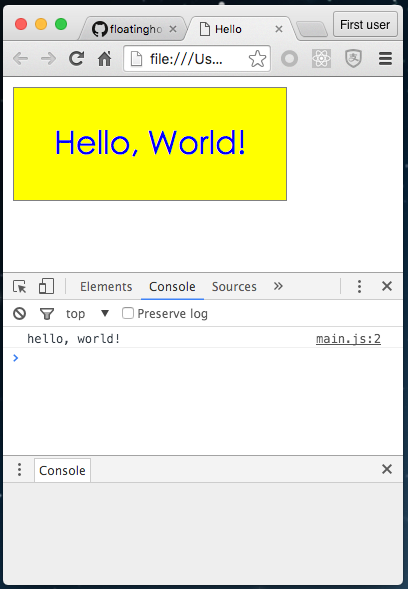

用 HTML5 / javascript 做开发，入门就是这么简单。

如果需要开发出高质量的 APP，需要熟练掌握 HTML/CSS 和 javascript，尤其是 HTML5 / CSS3，掌握 HTML DOM 以及 javascript 的一些常见库，例如 [jQuery](https://jquery.com/)，等等。这里有一些免费的入门教程：
* [HTML 系列教程](http://www.w3school.com.cn/h.asp)
* [JavaScript 入门教程](http://www.w3school.com.cn/js/index.asp)
* [JavaScript 高级教程](http://www.w3school.com.cn/js/index_pro.asp)

通过这些教程的学习，你能够做到：
* 一个简单的 index.html 页面；
* 一个统一的 main.css 文件，能够对界面元素的表现加以控制和调整；
* 一组 javascript 文件，能够通过对 HTML DOM 的访问，实现内容的动态展示和切换。

对于作为程序员的你，这根本不是什么难的事情。

### 单机版APP

下一步，我们要把这样一个简单的网页程序 (web app)，变成一个手机上的 APP。准确的说，它应该是叫 Hybrid APP，即混合程序。因为它的外面是 native app 封装了一个 webview，里面运行的是 我们写的 web app。

我们需要用到 cordova 技术框架。它原本是 Adobe 公司收购的一个小团队开发的产品，被重新命名为 [PhoneGap](http://phonegap.com/)。后来 Adobe 将其开源，并捐赠给 Apache 基金会，然后被称为 [Apache Cordova](https://cordova.apache.org/)，现在已经成为一个非常流行的技术框架，也得到很多商业公司的追捧，除了 Adobe 之外，Intel、微软、IBM 等公司也都推出了支持 Cordova 的产品。

Cordova 技术框架提供了一个命令行的工具，是用 nodejs 开发的。

我们首先要装 [nodejs](https://nodejs.org/en/)，安装之后，会提供 2 个基本的命令：
```bash
$ which node
/usr/local/bin/node
$ node -v
v4.2.1
$ npm -v
2.14.7
```
* node --- 负责 javascript 程序的编译／解释／执行。它是基于谷歌开源的 Chrome V8 引擎的，基于事件驱动、不阻塞 IO模式运行，轻量而高效。
* npm --- NodeJs Package Manager, 安装包管理器。所有的 nodejs 包都是用 npm 来下载和安装（你也可以用它来发布你自己的包到 npm 库）。

接下来，用 npm 安装 [cordova](https://cordova.apache.org/)：
```bash
$ npm install -g cordova
$ which cordova
/usr/local/bin/cordova
$ cordova -v
5.4.1
```

用 cordova 创建一个项目：
```bash
# 格式为：cordova create <目录名> <APP ID> <APP名字>
$ cordova create temp com.rjfun.demo Demo
```

然后编译，并在 iOS 模拟器中运行这个项目：
```bash
$ cd temp
$ cordova platform add ios
$ cordova build ios
$ cordova emulate ios
```

于是可以看到 iOS 模拟器被启动，然后 APP 运行：

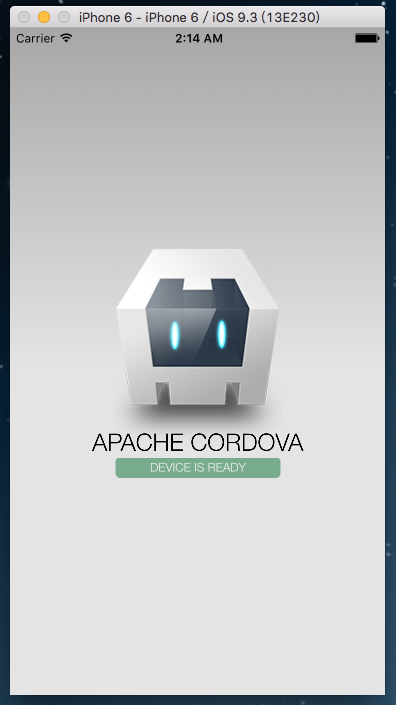

或者你也可以把 iPhone 用 USB 线连接到 Mac，然后用这个命令安装、启动刚刚编译的 APP：
```bash
$ cordova run ios --device
```

现在运行的是 Cordova 自带的 Demo 工程。打开 Cordova 项目，可以看到这样的目录结构：

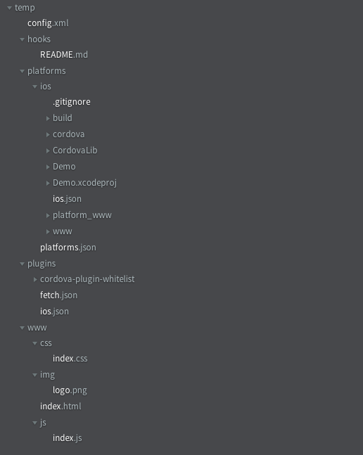

接下来，删去 www 目录下的内容，用我们前面写的 index.html, main.js, main.css 替换，并略作修改：
```html
<!-- index.html -->
<!DOCTYPE html>
<html>
<head>
  <meta charset="utf-8" />

  <!-- 下面的部分，是为了兼容移动设备的屏幕 -->
  <meta http-equiv="Content-Security-Policy" content="default-src 'self' data: gap: https://ssl.gstatic.com 'unsafe-eval'; style-src 'self' 'unsafe-inline'; media-src *">
  <meta name="format-detection" content="telephone=no">
  <meta name="msapplication-tap-highlight" content="no">
  <meta name="viewport" content="user-scalable=no, initial-scale=1, maximum-scale=1, minimum-scale=1, width=device-width">

  <!-- cordova 在 APP 编译打包时自动生成，用来初始化 cordova 框架代码 -->
  <script type="text/javascript" src="cordova.js"></script>

  <title>Hello</title>
  <script type="text/javascript" src="main.js"></script>
  <link rel="stylesheet" href="main.css"/>
</head>
<body>
<h1>Hello, World!</h1>
</body>
</html>
```

```javascript
// main.js
console.log('hello, world!');

// 当 APP 初始化完成，会触发 'deviceready' 事件，我们可以调用 cordova 框架以及插件提供的 API 和功能
document.addEventListener('deviceready', function(){
  console.log('deviceready');
  
  // TODO: 开始我们 web app 的业务逻辑
});
```

```css
/* main.css */
body {
  width: 100%;
  height: 100%;
  padding: 0px;
  margin: 0px;
  background-color: silver;
}
h1 {
  padding: 40px;
  margin: 30px;
  background-color: yellow;
  color: blue;
  border: 1px solid gray;
  display: inline-block;
}
```

重新运行 cordova 项目（会自动编译、安装、运行）：
```bash
$ cordova emulate ios
```

于是，可以看到 Web App 在 iOS 模拟器中运行了：

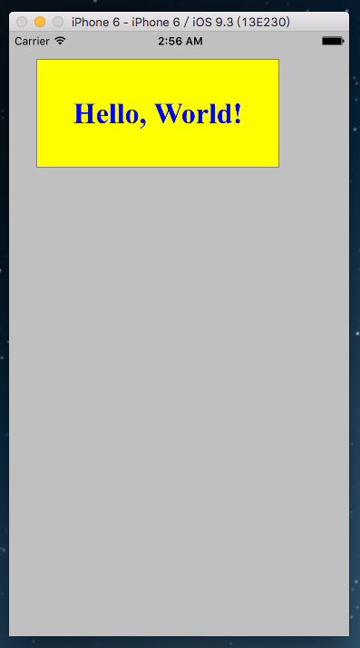

做个最简单的APP，其实也很简单，是不是？！

### 加个广告条

作为程序员，我们毫不怀疑，你可以通过掌握的 HTML/CSS 以及 javascript 编程能力，提供一些有趣、有用的功能。

接下来，我们要给这个 APP 加上变现（monetization）的功能，即实现赚到真金白银。

变现最简单的方法，就是加上广告条，例如谷歌的AdMob。
* 通过展示广告，用户对有兴趣的广告点击，浏览产品、或者安装其他的 APP。
* 投放广告的个人／公司（简称广告主，Advertizer）会支付广告费给谷歌。
* 而谷歌则会将其中的一部分，支付给发布广告的个人／公司（简称发布商, Publisher）。
* 谷歌在其中扮演的角色，则称之为广告平台（Ad Platform）、或者广告中介（Ad Network）。

Cordova 框架的技术架构，是 Web APP 加上一些通用的插件，提供手机特定功能的访问、与第三方系统的集成。

我们通过插件 cordova-plugin-admobpro 来实现与谷歌 AdMob 的集成。这是基于谷歌 AdMob SDK 开发的一个插件，也是目前变现插件中最流行、最容易使用的。

通过它，只需一行 javascript 代码就可以完成对 SDK API 的调用。

```bash
$ cordova plugin add cordova-plugin-admobpro
```

在 main.js 里面，在 APP 初始化完毕时，我们加几行代码。

```javascript
// main.js
console.log('hello, world!');

// 当 APP 初始化完成，会触发 'deviceready' 事件，我们可以调用 cordova 框架以及插件提供的 API 和功能
document.addEventListener('deviceready', function(){
  console.log('deviceready');
  
  // 在 APP 初始化完毕时，在屏幕下方创建一个广告条
  if(AdMob) AdMob.createBanner({
    adId: 'ca-app-pub-6869992474017983/4806197152', // 需要到 AdMob 官方网站注册用户，并创建广告单元 Ad Unit Id
    position: AdMob.AD_POSITION.BOTTOM_CENTER, // 展示在屏幕下方中央
    overlap: false, // 不要覆盖 Web APP 的内容
    isTesting: true, // 展示测试广告，在正式发布时，去掉这行
    autoShow: true // 广告资源就绪时，自动开始展示
  });
});
```

重新运行 cordova 项目（会自动编译、安装、运行）：
```bash
$ cordova emulate ios
```

于是，可以看到 Web App 在 iOS 模拟器中运行了：

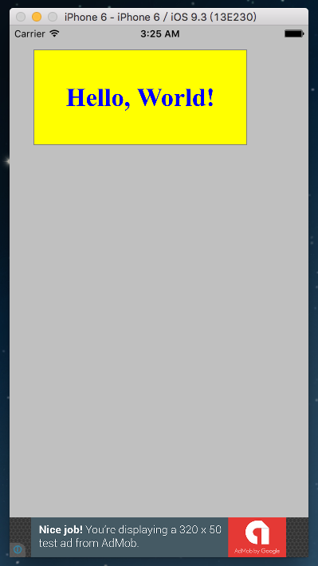

看，屏幕下方的广告条展示出来了。

这里只是仅供调试用的测试广告。我们需要到 [AdMob官方网站](https://apps.admob.com/)注册用户，并创建广告单元（Ad Unit Id），并用来替换掉 代码中 adId 后面的这串数字。并在发布的正式版本中，去掉 `isTesting:true` 这行代码。

### 注册广告账号

下面我们就介绍，如何注册账号，如何创建广告单元，如何设置银行收款信息。

由于价值观方面的原因，谷歌的网站基本上都是被隔离在中国大陆局域网之外，通常是无法访问的。需要通过 VPN 等科学上网的方式才能够访问。如果你不知道如何科学上网，可以写邮件给我，单独讨论这个问题，这里暂不展开。

访问谷歌AdMob官网（ https://www.google.com/admob/ ），注册新账号。

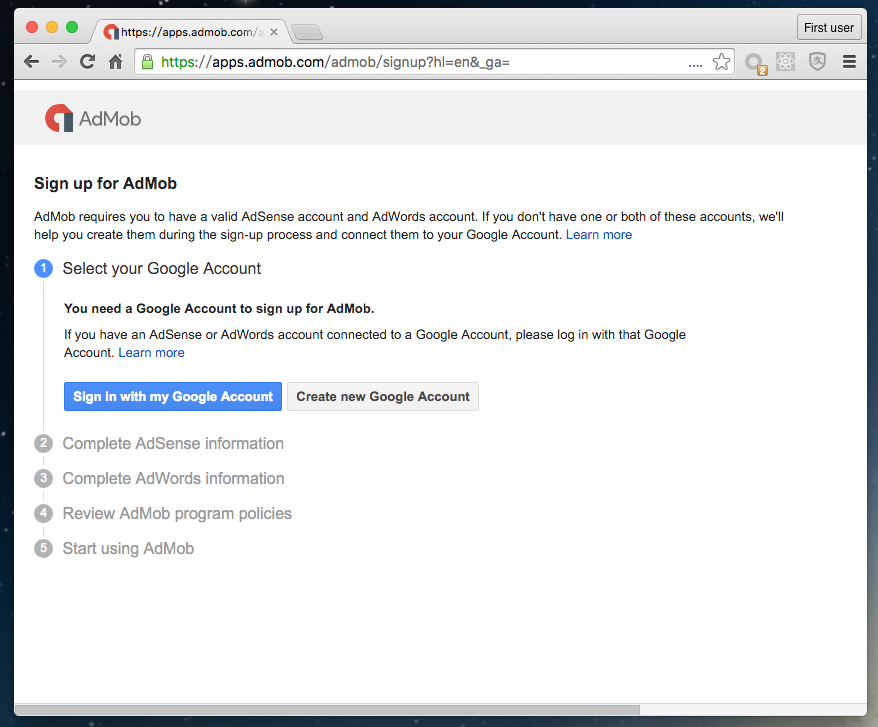

注册完成之后，登陆 AdMob 网站（ https://apps.admob.com/ ），点击菜单“获利”，点击左上角的红色按钮“＋通过新应用获利” 添加新APP：

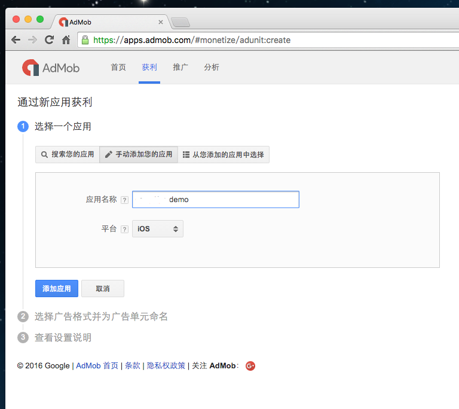

然后创建横幅广告：

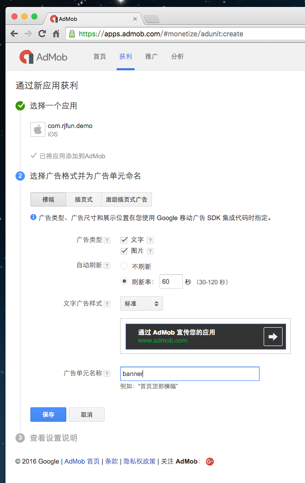

即可获得广告单元 ID，将其 copy 到源代码中：

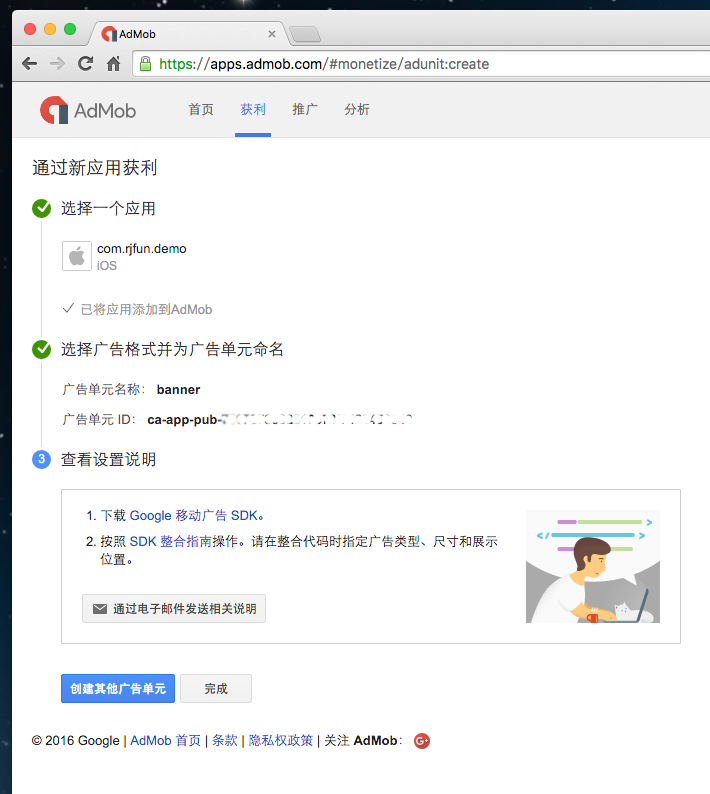

### 验证地址和设置收款信息

注册账号之后，广告单元进入APP投放实际使用，即可积累广告收益。

要收到谷歌支付的广告分成，还有 2 个步骤要完成：
* 验证地址。谷歌会生成一个 PIN 码，打印在卡片上，邮寄到你的通信地址。
* 设置收款信息。可以是 西联汇款 或者 银行账号。

不过，刚注册的账号还不允许设置这个信息。只有你的累计广告收入达到基本的门槛（目前是 10美金），谷歌才会允许进入设置支付信息的环节。谷歌通过这个方法，可以过滤掉大量的无效账号。

#### 验证 PIN 码：

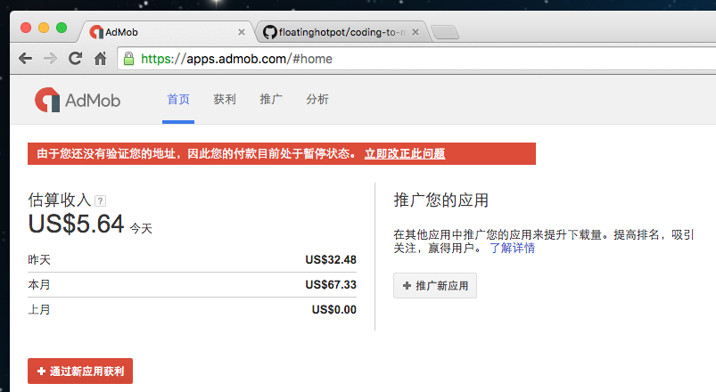

点击“立即改正此问题”，进入 PIN 码输入界面。

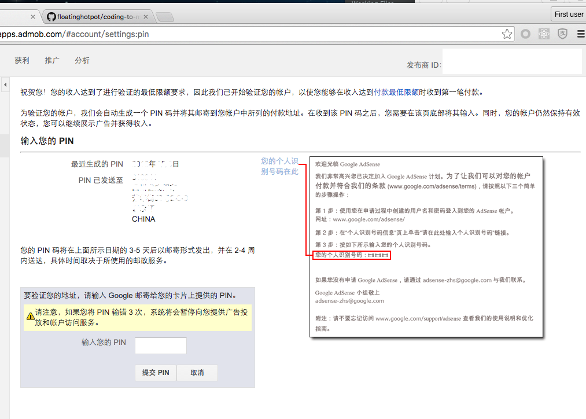

验证 PIN 码这个过程比较缓慢，通常需要 2-4 周的时间。所以如果显示了最近生成 PIN 码的日期，就耐心等待吧。收到 PIN 码之后，就将其输入上面这个框，提交验证。

#### 设置收款信息：

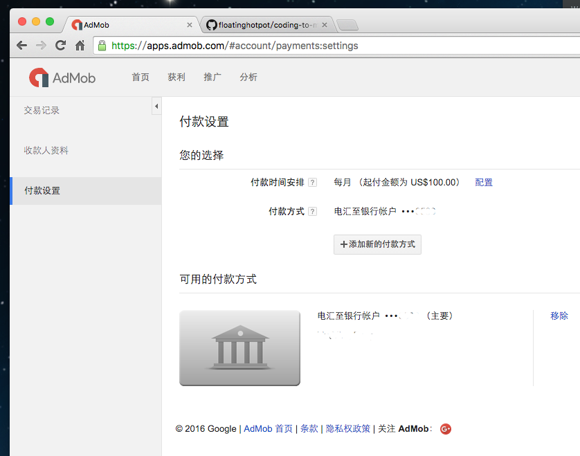

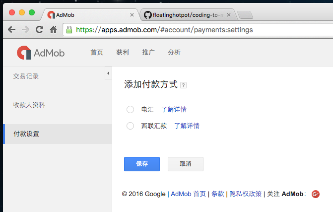

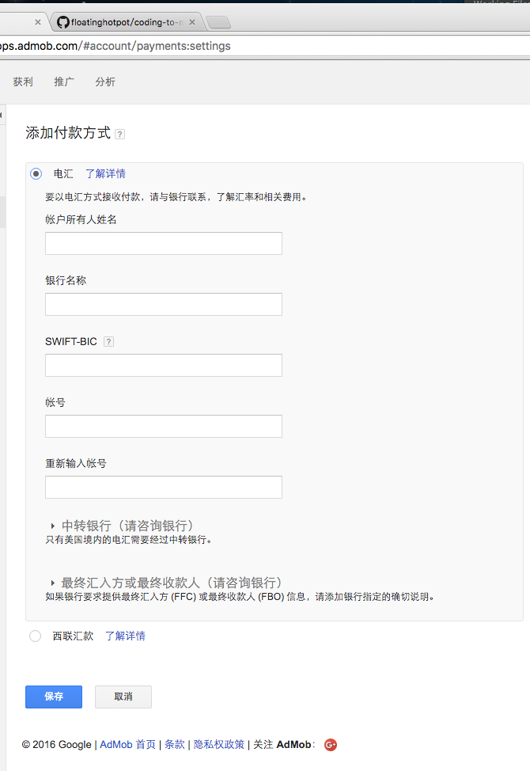

等这 2 个步骤设置完成，当产生广告收益的时候，谷歌就会在每个月的月末，计算当月的广告收益，然后在下个月的 20日左右支付给你。

### 发布APP

我们完成的 APP，要被用户安装使用并产生收益，还缺少一个重要的环节：发布 到应用商店。
* 如果是 Android APP，通常是 Google Play Store。中国大陆用户通常访问不到，则可以选择发布到大陆的一些应用商店，例如 360、豌豆荚 等等。
* 如果是 iOS APP，则是发布到苹果 AppStore。

这里我们以苹果 AppStore 为例，来说明如何注册开发者账号，并发布 APP。

访问苹果开发者网站（ https://developer.apple.com/ ），并注册登录。要在 苹果AppStore发布应用，需要支付每年 99 美金的年费，对于个人开发者、公司开发者，这个费用都是一样的。

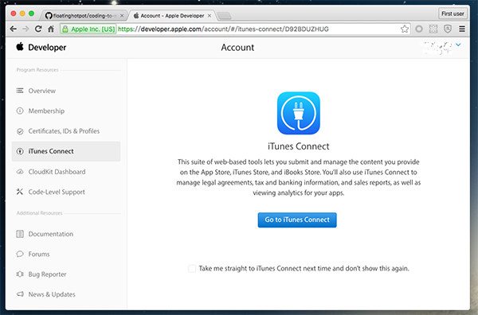

注册成功的开发者，需要下面几个步骤，才能将 APP 发布到 AppStore：
* 生成开发者数字证书，用于安装包的签名。
* 为你的 APP 创建 APP ID，如果不涉及内购，也可以用 “*” 或者 “com.rjfun.*” 作为一个通用的 APP ID，在多个 APP 中使用。
* 为你的 APP 生成 Provisioning Profiles，并下载到 本地用 Xcode 打开、管理。

然后用 Xcode 打开 Cordova 项目里的 XXX.xcodeproj 工程文件，编译并存档（Archive）。成功存档的 APP 包，才能提交到 AppStore 进行审核。

APP 提交前，需要到 iTunesConnect （ https://itunesconnect.apple.com/ )，准备、发布和管理你的 APP。

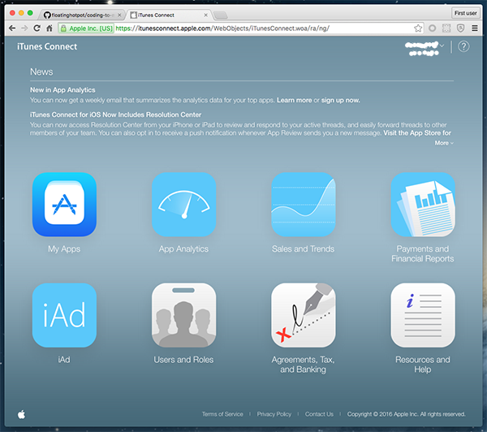

创建新的 APP，加上名字、介绍、图标、定价等信息，并将其设置为准备提交的状态，然后就可以通过 Xcode 中的 Organizer 将成功存档（Archive）的安装包提交到 AppStore 进行审核了。

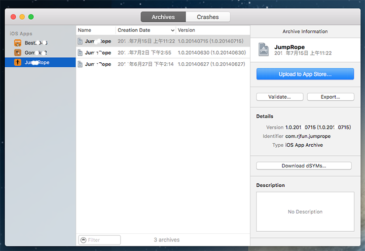

苹果审核 APP 的流程大约 1 周左右的时间。如果审核通过，就可以在 AppStore 里面看到你发布的 APP 了。

### 广告收益的计算

当用户在设备中下载、安装APP并运行的时候，就会从谷歌的广告服务器请求正式的广告内容，并用于展示了。

你可以登陆谷歌 AdMob 网站，查看每天的广告展示量、点击率、以及产生的收益。这个网站也提供了非常强大的报表功能，可以根据国家、广告单元、时间段，显示非常详细的报告。谷歌在 AppStore 上发布有一个 AdSense 的 APP，你可以安装这个 APP，每天查看你的 AdMob 收益。

每次用户对感兴趣的广告进行点击，就会产生广告收益。大部分的广告投放，是按照点击次数计算费用的，即所谓的 CPC 广告。

在计算广告收益的时候，有几个常见的基本术语：
* CPC（Cost Per Click，每次点击费用），大约是 US$ 0.06 ~ 1.0;
* CTR（Click Through Rate，展示点击率），大量统计的结果大约是 1%;
* CPM (Cost Per Mile, 每千次展示费用），通过 CPC 和 CPR 也能够推算出 CPM，大致范围是 US$ 0.5 ~ 5。

每次点击的价格，根据广告投放的价格不同而不同。全球不同国家由于经济水平不同，也存在很大的差异。例如，在美国，一次广告点击可能产生 1 美元的收益，在巴西，也许只有10 美分，相差 10~20 倍。

如果我们按照 CPM （每千次展示费用）1美元 来估算，每天 10万次广告展示，大约可以产生 $100美元现金收益。按照 6.45 的汇率计算，一个月30天（包括周末和节假日！），大约可以产生的收益是 ¥19,350。

而在上海，5年经验的、技术能力还不错的程序员，薪资大约也就 15,000 左右。如果你做的 APP，每天能够有 1万个用户使用，基本上产生的广告收益和现金流，就可以达到一个程序员的工资水平。

我认识一个巴西人，他用 HTML5 技术实现的小游戏，简单，但是非常有趣。每天的活跃用户大约是 10万，广告收益已经超过每个月 15万，从而实现了财务自由。

### 进阶篇

### 需求是根本

前面我们介绍了如何为 APP 增加了变现（monetization）的能力。但要真正获得可观的收益，还必须得有足够多的用户。也就是说，你必须开发出足够好的 APP，能够真正解决用户的问题，才会有更多的用户使用、更高频度的使用。

如何能够开发出更受用户欢迎的 APP 呢？其实这不是一个编程问题。

也许你是一个技术的大牛，但是最艰深、最牛X的技术，开发出来的软件产品未必是受到用户欢迎的产品。有时候，你用了一种其实比较简单的技术，但是真正关注了用户的痛点，解决了用户关心的问题，很可能你的产品就会受到用户的欢迎，创造出口口相传的良好口碑，在社交网络得到自然传播。

我推荐一本书，《需求-缔造伟大商业传奇的根本力量》，作者是亚德里安•斯莱沃斯基。

以下是某些创业成功者的推荐：

> 这是一本好书，每个创业者和每个公司管理者都值得一看，甚至公司中的每个人都应该了解和体会其中的概念。书中给出了一些创造需求的模式，这对读者是非常有价值的，我们需要好的理念，但我们更需要可以践行理念的方法。这两点本书都做到了，非常值得一读，特荐之。
——孙陶然 ，拉卡拉支付有限公司创始人、董事长兼总裁，《创业36条军规》作者

> 每一个抱怨的背后都隐藏着一个未被满足的需求，而每一个需求的背后必然隐藏着一个不可忽视的市场。其实任何产品，在一开始满足了用户的功能性需求以后，就应该着手升级到精神层面，用户拒绝麻烦，用户需要安慰，这看起来跟利润无关，但是对不起，它跟你的市场有关。你不去满足，创业者就会自己去进行开拓性满足。那么等待你的，或将是个生死存亡的巨大危机。因此，请一定重视麻烦所带来的希望，而不是去抵触他们的抱怨。这正是《需求》给我们带来的最有价值的东西。
——杜子建，华艺传媒创始人，社会化媒体营销研究者，畅销书《微力无边》作者

### 用户体验

为什么苹果手机卖得贵，依然热卖？无疑它是以优秀的用户体验取胜的。如果你看过《乔布斯传》，你可以知道，苹果手机的诞生，其实是解决了传统手机难于使用的痛点。

自然我们在手机上开发的 APP 或者 游戏，也必须要高度关注用户体验，并且把它放到战略重点的位置上来。手机 APP，不追求功能的强大、齐全，可以只做一个小小的功能，但是要切实关注用户的需求点、并提供优秀的用户体验。

一个相当典型的例子是这款《手电筒》APP，就是打开手机的 LED灯泡，用来临时照亮黑暗。

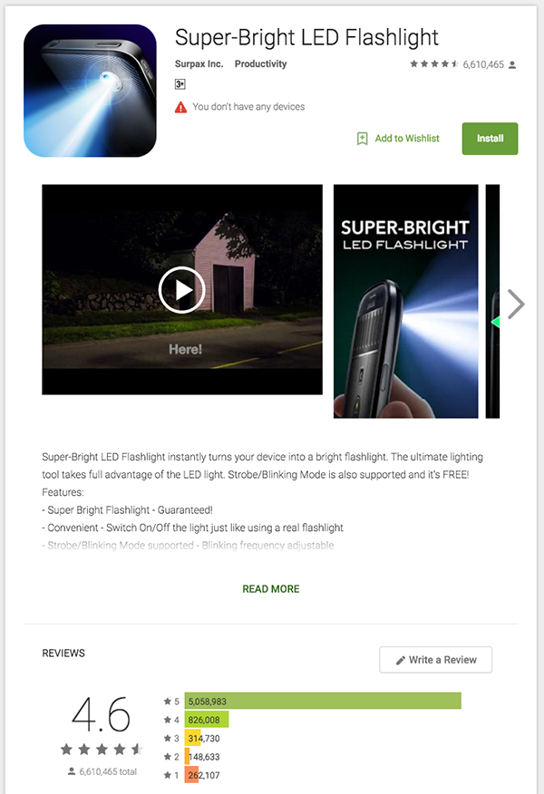

这款 APP 的用户已经超过好几亿，自然收益也是极其可观。

评价的数量超过6千万人次，它的用户是这样写的：
* Jennifer Baylis: 易于使用。#1 最棒的手电筒APP！非常容易使用，打开很快！
* Kitty Davis: 我正是需要这样一个手电筒 APP。
* Dennis Castello: 它正是做到了需要它做的事，而且做的真的很好。
* Joseph Low: 易于使用。轻松地让它干活！强烈推荐！

### 哪种广告最适合

在移动广告领域，存在多种形式的广告，并且也在不断的发展。
* banner Ad，横幅广告
* interstitial Ad，插屏广告
* native Ad，原生广告
* reward video Ad，奖励视频广告
* IAP (in-app purchase) Ad，内购广告

哪种广告适合你的 APP，需要很好的权衡用户体验和收益之间的关系。如果广告展示不当，或者展示过于频繁，影响了用户体验甚至招致用户反感，就本末倒置了。

横幅广告

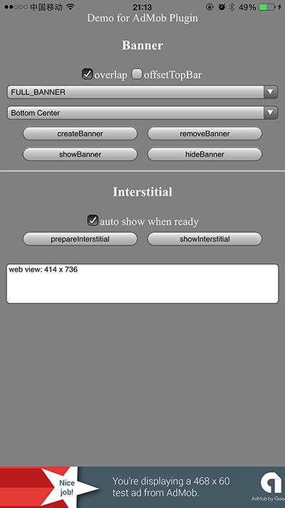

插屏广告

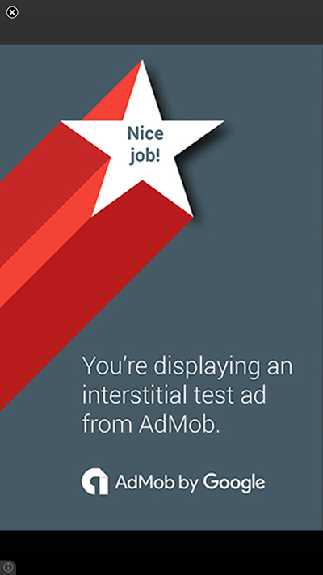

### 哪家广告商最靠谱

因为移动广告领域的利润可观，移动广告平台的发展也是非常快的。过去的这些年，也发生了不少并购案。例如 Google先后收购了 DoubleClick 和 AdMob，Flurry 被 Yahoo! 收购，MobFox 被 Matomy 收购，Millennial Media 被 AOL 收购。

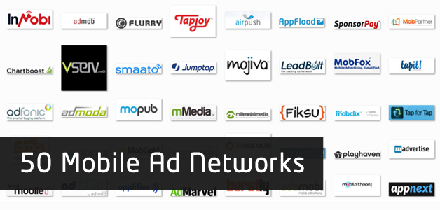

通常广告平台会提供：
* 接入广告系统的 SDK；
* 注册、登录和管理广告的系统；
* 接入指南、例程、FAQ；

各种移动广告平台的相关介绍，可以通过搜索活着其他不同的渠道去了解（例如 StackOverflow.com），并可以有选择性的进行尝试。

以下是我试用过的一些广告平台：
* Google AdMob
* Facebook AudienceNetwork
* Yahoo! Flurry
* MobFox
* Apple iAd
* MoPub
* Millennial Media
* InMobi
* OpenX
* Smart AdServer
* ... ...

使用下来比较满意的有 AdMob, Facebook AudienceNetwork, Yahoo! Flurry, MobFox。尤其是 AdMob，非常值得推荐。

AdMob之所以值得强烈推加你，主要有这样一些突出的优点：
* 广告填充率高（基本上在 98% 以上，有个别国家略低于90%），因此可以充分利用用户流量；
* 付款及时，每个月的月底结算，次月 20日支付；
* SDK 非常稳定，接入文档以及参考代码易于使用，并且有不同语言的文档和系统界面；
* 报表系统功能强大、易于使用，可以通过不同的维度进行数据分析；
* 有专门的 APP 可以用来跟踪收益；
* 有专门的技术支持，有官方支持的论坛，专门解答 SDK 接入方面的技术问题；
* 客户服务非常到位，非常的耐心和友善。
* 定期会组织一些宣讲、培训活动，也定期有线上视频讲座。

Facebook 的 AudienceNetwork 也挺不错。Facebook 不仅仅是最大、最活跃的社交媒体，也提供各种相关 SDK，包括广告用的 AudienceNetwork。其开发者网站为：https://developers.facebook.com/docs/audience-network 。
* Facebook 的 广告填充率(Fill Rate)没有 AdMOb 那么高，大约在45～75% 之间。
* Facebook 付款也很及时，也是在每个月的 21日左右支付上个月的广告收益；
* Facebook 的 SDK 更新非常频繁，大约 2 周左右就会发布一个新的版本，因此如果有什么 bug 修复也很快。不过更新的频度实在有点高，有时候有点跟不上的感觉。相对来说，谷歌 AdMob 的 SDK 更加稳定一些；
* 管理界面和报表系统也比较清楚易用，一目了然。报表系统没有 AdMob 的那么强大和灵活，貌似仅有英文界面，看上去是下面这样的。

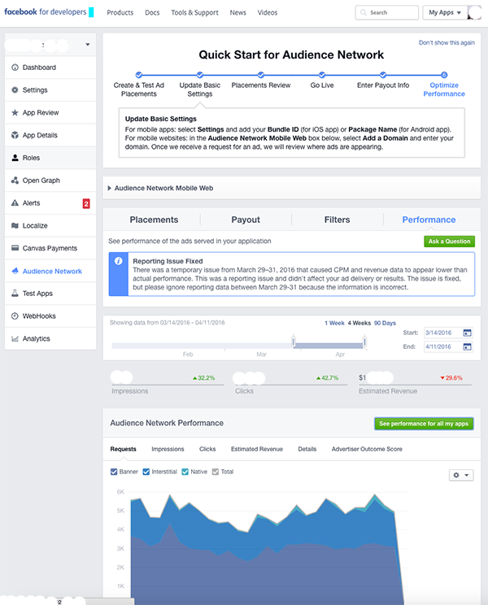

Flurry 是一家被 Yahoo！收购的移动广告公司，其官方网站是 http://www.flurry.com/ 。其主要的产品有 2 个，一个是数据分析(Flurry Anlytics)，一个是广告系统（Flurry Ads）。
* Flurry SDK 接入也还算比较容易，报表系统中规中矩。就是网站访问稍微有点慢，比较花时间。
* 付款略慢，在广告收益产生的 60天之后才付款。
* 值得一提的是，Flurry 是比较早支持原生广告的（Native Ad）的。

MobFox 是一家欧洲的移动广告公司，总部位于奥地利。曾经它的 CEO 联系过我，希望能够就某项产品达成合作。后来因为收购事宜暂停，再后来，再后来就知道 MobFox 被 Matomy 收购，项目合作的事情就没有下文了。这家公司还是不错，付款也比较及时。虽然号称是欧洲最大的移动广告公司，并且全球位于 Top 10，但和 Google、Facebook 这样的巨头比起来，在全球范围内的影响力实在太弱。

Apple 的 iAd，只是在 iOS 系统上进行投放。由于 iPhone 的市场定位和定价明显要高于 Android 系统，也就决定了 iOS 用户有较强的购买力，所以 iAd 广告的点击回报比较高，也就不言而喻了。不过如果你开发的 APP 需要同时投放 iOS 和 Android 系统，用 AdMob 管理起来相对容易一点。也可以通过 AdMob 的广告中介（mediation）功能，把部分流量通过 iAd 进行展示，从而使得广告收益的利益最大化。

像 OpenX 和 Smart AdServer 仅对欧美的签约客户开放，并不针对全球用户和开发者。只是曾经有美国和欧洲的客户在 GitHub 上看到我的开源项目，特意找到我要求我定制产品，通过项目合作的方式，我才得以了解和熟悉。不过因为不对全球开发者，所以也无法推荐使用。

至于 MoPub，它的 SDK 的是在 GitHub 上开源的，这是它与众不同的地方。不过也正是因为这一点，其文档和 SDK 接入就要稍微麻烦一些。必须要把这些 SDK 从源代码编译成 jar 和 framework，然后才能在自己的项目中使用。

Millennial Media（简写为 mMeida)，其 SDK Demo 的美观度做得不错，不过客服和技术支持的响应实在不敢恭维。曾经碰到过技术问题，通过 Web Form 提交了问题，一直没有得到过答复，所以我后来也就懒得用它了。

另外像 Charboost、TapJoy 等等广告平台，也或多或少的接触过。不过精力有限，没有逐一进行具体的试用。Charboost 是 2011 年才创业的广告公司，只专注在移动游戏领域，2014年被 VentureBeat 指数报告定为 Top 10 的移动广告公司。通过 Chartboost 发布的广告，点击收益比较不错，不过反过来说，也就是广告投放、获取用户的成本是比较高的。我所认识的专门做游戏、投放海外市场的朋友，通过 Facebook 和 Chartboost 投放广告用得比较多。

### 营销你的产品

### 联网版APP

### 云服务

### 高级篇

### 用户数据分析

### 广告优化

### 支付与内购

### 社交营销

### 广告投放

### 附录

#### 如何发布 APP 到 Apple AppStore

#### 如何发布 APP 到 Google Play Store

#### 如何发布 APP 到 360 应用商店

#### 如何用 Google Analytics 做用户数据分析


